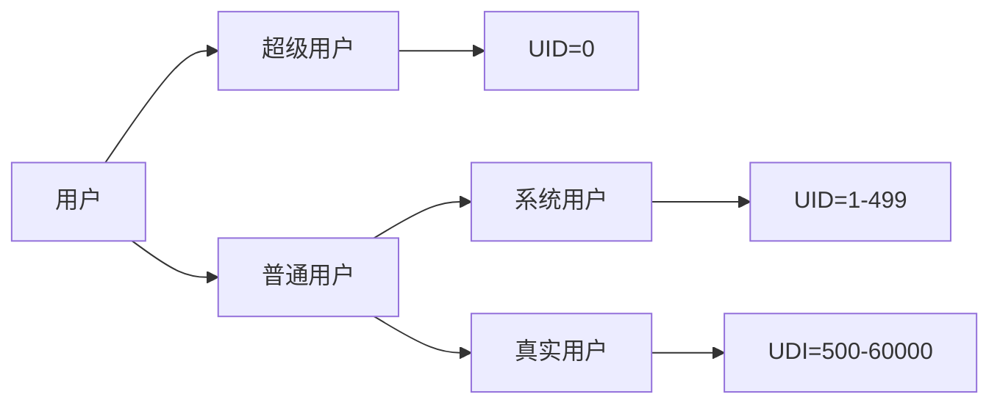
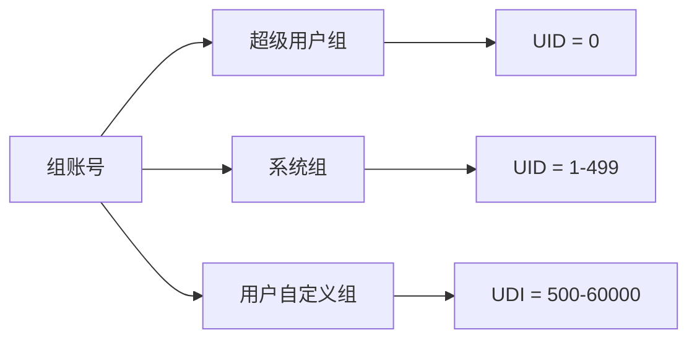

## 组，用户&组管理

### Linux 账号分类

`Linux`支持多少个用户账号：2^32	大约是   4294967296

#### 用户账号

控制用户账号文件：/etc/passwd

控制用户密码文件：/etc/shadow

##### 用户账号文件：/etc/passwd，分隔符为：[:]  冒号

| login_name | password | UID  | GID  | COMMENT | home  | shell     |
| ---------- | -------- | ---- | ---- | ------- | ----- | --------- |
| root       | x        | 0    | 0    | root    | /root | /bin/bash |

- `login_name`：是代表用户账号的字符串。通常长度不超过8个字符，并且由大小写字母和（/）或数字组成。登录名中不能有冒号（:），因为冒号在这里是分隔符。为了兼容起见，登录名中最好不要包含点字符（.），并且不使用连字符（-）和加号（+）开头。
- `password`：一些系统中，存放着加密后的用户口令。虽然这个字段存放的知识用户口令的加密串，不是明文，但是由于/etc/passwd文件对所有用户都是可读的，所以这仍是一个安全隐患。因此，现在许多Linux系统都使用了shadow技术，把真正的加密后的用户口令存放到/etc/shadow文件中，而在/etc/passwd文件的口令字段中只存放一个特殊的字符，例如：（X）或者（*）
- `UID`：用户标识号，是一个整数，系统内部用它来标识用户，一般情况下它与用户名是一一对应的。如果几个用户名对应的标识号是一样的，系统内部将它们视为同一个用户，但是它们可以有不同的口令、不同的主目录以及不同的登录shell等。取值范围是0-65525。0是超级用户root的标识号，1-99有系统保留，作为管理账号，普通的标识号从100开始，在Linux系统中，这个界限是从500开始。
- `DID`：组标识号，该字段记录的是用户所属的用户组。它对应着/etc/group文件中的一条记录
- `comment`：注释性描述，该字段记录着用户的一些跟人情况，例如用户的真实姓名、电话、地址等。这个字段并没有什么实际的用途，在不同的Linux系统中，这个字段的格式没有统一。在许多Linux系统中，这个字段存放的是一段任意的注释性描述文字，用做`finger`命令的输出。
- `home`：主目录，也就是用户的起始工作目录，它是用户在登录到系统之后所处的目录。在大多数系统中，各用户的主目录都被组织在同一个特定的目录下，而用户主目录的名称就是该用户的登录名。各用户对自己的主目录有读、写、执行（搜索）权限，其他用户对此目录的访问权限则根据具体的抢矿设置。
- `shell`：登录shell，用户登录后，要启动一个进程，负责将用户的操作传给内核，这个进程是用户登录到系统后运行的命令解释器或某个特定的程序，即shell。Shell是用户与Linux系统之间的接口。Linux的shell有多种，每种都有不同的特定。常用的有sh、csh、ksh、tcsh、bash、等。系统管理员可以根据系统情况和用户习惯为用户指定某个shell。如果不指定shell，那么redhat类的系统使用bash为默认的登录shell，即这个字段的值为/bin/bash
  - `shell类型`
    - 交互式：
      - /bin/bash
      - /bin/dash
      - /bin/tcsh
    - 非交互式shell
      - /sbin/nologin	登录后马上踢出
      - /bin/false   密码错误

> 用户的登录shell可以指定为某个特定的程序（此程序不是一个命令解释器）。利用这一特点，我们可以限制用户只能运行指定的应用程序，在该应用程序运行结束后，用户就自动退出了系统。有些LInux系统要求只有那些在系统中登记了的程序才能出现在这个字段中。

##### 用户密码文件：/etc/shadow，分隔符为：[:]  冒号

与/etc/passwd文件不同，/etc/shadow文件是只有系统管理员才有权利进行查看和修改的文件，系统管理员应该弄明白/etc/shadow文件中每个字符段的相应的意义，清楚管理时的具体意义。

shadow 是 passwd 的影子文件。在Linux 中，口令文件在 /etc/passwd中，早期的这个文件直接存放了加密后的密码，前两位是”盐“值，是一个随机数，后面跟的是加密的密码，为了安全，现在的Linux都提供了/etc/shadow这个影子文件，密码放在这个文件里面，并且只有root是可读的。

/etc/passwd文件中的每个条目有7个域，上面有介绍，在利用了shadow文件的情况下，密码用一个X标识，普通用户看不到任何密码信息，影子口令文件保存加密的口令；/etc/passwd文件中的密码全部变成X，shadow只能是root可读，从而保证了安全。

| login_name | password | last_change      | min_days     | max_days     | warning  | inactive   | expire   | disable  |
| ---------- | -------- | ---------------- | ------------ | ------------ | -------- | ---------- | -------- | -------- |
| 登录名     | 加密口令 | 最后一次修改时间 | 最短使用期限 | 最长使用期限 | 警告时间 | 不活动时间 | 失效时间 | 是否锁定 |

- `登录名`：是与/etc/passwd文件中的登录名相一致的用户账号
- `口令`：字段存放的是加密后的用户口令字，长度为13个字符。如果为空，则对应用户没有口令，登录时不需要口令；如果含有不属于集合{./0-9A-Za-z}中的字符，则对应的用户不能登录。
- `最后一次修改时间`：表示的是从某个时刻起，到用户最后一次修改口令时的天数。时间起点对不同的系统可能不一样。例如在SCOLinux中，这个时间起点是1970年1月1日。
- `最短使用期限`：指的是两次修改口令之间所需的最小天数。
- `最长使用期限`：指的是口令保持有效的最大天数。
- `警告时间`：字段表示的是从系统开始警告用户到用户密码正式失效之间的天数。
- `不活动时间`：表示的是用户没有登录活动但账号仍能保持有效的最大天数。
- `失效时间`：字段给出的是一个绝对的天数，如果使用了这个字段，那么就给出相应账号的生存期。期满后，该账号就不再是一个合法的账号，也就不能再用来登录了。

#### 组账号

控制组账号文件：/etc/group

控制组密码文件：/etc/gshadow

##### 组账号文件：/etc/group

将用户分组是`Linux`系统中对用户进行管理及控制访问权限的一种手段。每个用户都属于某个用户组；一个组中可以有多个用户，一个用户也可以属于不同的组。当一个用户同时是多个组中的成员时，在/etc/passwd文件中记录的是用户所属的主组，也就是登录时所属的默认组，而其他组成为附加组。

用户要访问属于附加组的文件时，必须首先使用`newgrp`命令使自己成为所要访问的组中的成员。用户组的所有信息都存放在/etc/group文件中。此文件的格式也类似于/etc/passwd文件，由冒号（:）隔开若干个字段，

| 组名 | 口令 | 组标识号 | 组内的用户列表 |
| ---- | ---- | -------- | -------------- |
| root | X    | 0        | root           |

- `组名`：是用户组的名称，由字母或数据构成，与/etc/passwd中的登录名一样，组名不能重复
- `口令`：该字段存放的是用户组加密后的口令字。一般Linux系统的用户组都没有口令，即这个字段一般为空，或者是（*）
- `组标识号`：与用户标识号类似，也是一个整数，被系统内部用来标识组
- `组内用户列表`：是属于这个组的所有用户的列表，不同用户之间用逗号（,）分隔，这个用户组可能是用户的主组，也可能是附加组。

## 管理

| 管理命令 | 组       | 用户    |
| -------- | -------- | ------- |
| 添加     | groupadd | useradd |
| 更改     | groupmod | usermod |
| 删除     | groupdel | userdel |
| 设置密码 | gpasswd  | passwd  |

#### useradd（添加用户）

>  `useradd`命令用于Linux中创建新的用户，创建用户不指定选项的默认规则在配置文件`/etc/login.defs`和`/etc/default/useradd`中

- 语法：useradd 选项 参数
  - useradd options username

##### options（选项）

- `-u` ：指定UID
- `-g`：指定主要群组
- `-G`：指定次要群组
- `-d`：用户家目录
- `-s`：指定shell类型
- `-c`：指定描述信息
- `-p`：指定加密后的密码
- `-m|M`：m=建立家目录，M=不建立家目录
- `-n`：取消建立私有群组
- `-r`：指定用户身份为系统用户

##### arguments（参数）

用户名：要创建的用户名

##### #### usermod（修改用户）

> `usermod`命令用于修改用户的基本信息。`usermod`命令不允许修改正在线上使用着的账号迷城。当`usermode`命令用来改变 `user id`，必须确认这名用户没有在电脑上执行任何程序。

- 语法：usermod 选项 参数
  - usermod options arguments

##### options（选项）

- `-c`<备注>：修改用户帐号的备注文字；
- `-d`<登入目录>：修改用户登入时的目录；
- `-e`<有效期限>：修改帐号的有效期限；
- `-f`<缓冲天数>：修改在密码过期后多少天即关闭该帐号；
- `-g`<群组>：修改用户所属的群组；
- `-G`<群组>；修改用户所属的附加群组；
- `-l`<帐号名称>：修改用户帐号名称；
- `-L`：锁定用户密码，使密码无效；
- `-s`<shell>：修改用户登入后所使用的shell；
- `-u`<uid>：修改用户ID；
- `-U`：解除密码锁定。

##### arguments（参数）

登录名：指定要修改信息的用户登录名

#### userdel（删除用户）

> `userdel`命令用于删除给定的用户，以及用户相关的文件。若不加选项，则仅删除用户账号，而不删除相关文件。

- 语法：userdel 选项 参数
  - userdel options arguments

##### options（选项）

- `-f`：强制删除用户，即使用户当前已登录
- `-r`：删除用户的同时，删除与用户相关的所有文件

##### argument（参数）

- 用户名：要删除的用户名。