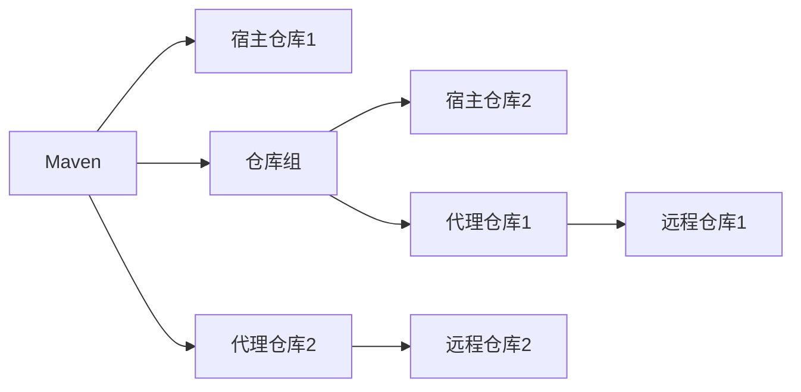

# 一、Neuxs介绍

Nexus是一个强大的Maven仓库管理器，它极大的简化了本地内部仓库的维护和外部仓库的访问。
如果使用了公共的Maven仓库服务器，可以从Maven中央仓库下载所需要的构件(Artifact)，但这通常不是一个好的做法。
正常做法是在本地架设一个Maven仓库服务器，即利用Nexus私服可以只在一个地方就能够完全控制访问和部署在你所维护仓库中的每个Artifact。
Nexus在代理远程仓库的同时维护本地仓库，以降低中央仓库的负荷,节省外网带宽和时间，Nexus私服就可以满足这样的需要。
Nexus是一套“开箱即用”的系统不需要数据库，它使用文件系统加Lucene来组织数据。
Nexus使用ExtJS来开发界面，利用Restlet来提供完整的REST APIs，通过m2eclipse与Eclipse集成使用。
Nexus支持WebDAV与LDAP安全身份认证。
Nexus还提供了强大的仓库管理功能，构件搜索功能，它基于REST，友好的UI是一个extjs的REST客户端，它占用较少的内存，基于简单文件系统而非数据库。

# 二、为什么要构建Nexus私服？

如果没有Neuxs私服，我们所需的所有构件都需要通过Maven的中央仓库和第三方的Maven仓库下载到本地，而一个段对中的所有人都重复的从Maven仓库下载构件无疑加大了仓库的负载和浪费了外网带宽，如果网速慢的话，还会影响项目的进程。很多情况下项目的开发都是在内网进行的，连接不到Maven仓库怎么办呢？开发的公共构件怎么让其他项目使用？这个时候我们不得不为自己的团队搭建属于自己的Maven私服，这样既节省了网络带宽也会加速项目搭建的进程，当然前提条件就是你的私服中拥有项目所需的所有构件。

# 三、在本地构建Nexus私服的好处:

1. 加速构建；

2. 节省带宽；

3. 节省中央Maven仓库的带宽；

4. 稳定(应付一旦中央服务器出问题的情况)；

5. 控制和审计；

6. 能够部署第三方构件；

7. 可以简历本地内部仓库；

8. 可以简历公共仓库

这些有点使得Nexus日趋成为最流行的Maven仓库管理器。

# 四、Nexus说明

### componet name的说明

- **maven-central：**maven中央仓库，默认从https://repo1.maven.org/maven2/拉取jar
- **maven-releases：**私库发行版jar
- **maven-snapshots：**私库快照（调试版本）jar
- **maven-public：**仓库分组，把上面三个仓库组合在一起对外提供服务，在本地maven基础配置settings.xml中使用

### Nexus默认的仓库有以下四种

- **group：**仓库组类型，又叫仓库组，用户方便开发人员自己设定的仓库；
- **hosted：**宿主类型，内部项目的发布仓库（内部开发人员，发布上去存放的仓库）；
- **proxy：**代理类型，从远程中央仓库中寻找数据的仓库（可以修改对应仓库的proxy标签的Remote Stroage属性的值，修改对应的远程仓库的路径）；
- **virtual：**虚拟类型，虚拟仓库，新版本已取消该仓库；

### Policy（策略）

- 表示该仓库为发布（Releases）版本仓库还是快照（Snapshot）版本仓库

### Piblic Repositories下的仓库

1. **3rd party：**无法从公共仓库获得的第三方发布版本的构建仓库，即第三方依赖的仓库，这个数据通常是由内部人员自行下载之后发布上去；
2. **Apache Snapshots：**用来代理ApacheMaven仓库快照版本的构建仓库；
3. **Central：**用来代理maven中央仓库中发布版本构建的仓库；
4. **Central M1 shadow：**用于提供中央仓库中M1格式的发布版本的构建镜像仓库；
5. **Codehaus Snapshots：**用来代理CodehausMaven仓库的快照版本构建的仓库；
6. **Releases：**内部的模块中release模块的发布仓库，用来部署管理内部的发布版本构建的宿主类型仓库；release是发布版本；
7. **Snapshots：**发布内部的SNAPSHOT模块的仓库，用来部署管理内部的快照版本构建的宿主类型仓库；snapshots是快照版本，也就是不稳定版本；

> 所以自定义构建的仓库组代理仓库的顺序为：Releases、Snapshots、3rd party、Central。也可以使用sochina放到Central前面，下载包会更快。

### Nexus 默认的端口

- 默认端口是8081，可以在NEXUS_HOME/etc/nexus-default.properties配置文件中修改

### Nexus默认的用户名密码

| 用户名 | 密码     |
| ------ | -------- |
| admin  | admin123 |

### Nexus的工作目录

- **sonatype-work：**路径一般在nexus同级目录下

```
[root@master-node local]# pwd
/usr/local
[root@master-node local]# ls nexus/
bin deploy etc lib LICENSE.txt NOTICE.txt public system
[root@master-node local]# ls sonatype-work/
nexus3
[root@master-node local]# ls sonatype-work/nexus3/
backup blobs cache db elasticsearch etc generated-bundles health-check instances keystores lock log orient port tmp
```

### Nexus仓库分类的概念

1. Maven可直接从宿主仓库下载构件，也可以从代理仓库下载构件，而代理仓库间接的从远程仓库下载并缓存构件；
2. 为了方便，Maven可以从仓库组下载构件，而仓库组并没有时间的内容，它会转向包含的宿主仓库或者代理仓库获得实际构件的内容。




### 当遇到奇怪的问题时

- 重启nexus，重启后web界面要1分钟左右才能访问


# Neuxs页面介绍

## 一、Browse Server Content


### 1. Search

- 搜索功能，从私服上查找是否有搜索的包。支持模糊查询


### 2. Broese

- 查看都有哪些仓库


## 二、服务器管理和配置

- 就是页面上方靠左边的齿轮状按钮，如果要看到这个选项的前提是需要管理员账号登录的。


### 1. Blob Stores

- 文件存储的地方，创建一个目录的话，对应服务器上文件系统就创建一个目录，如图所示：


### 2. Reposittories(存储库)


#### Proxy仓库（代理仓库）

代理中央Maven仓库，当客户端访问中央库的时候，先通过Proxy下载到Nexus仓库，然后在从Nexus仓库下载到客户端；这样的优势是只要任意一个人从中央仓库下载下来了，以后大家都可以从Nexus私服上进行下载；私服一般部署在内网，这样大大节约了带宽。

- 创建proxy的具体步骤，以创建yum代理仓库为例

  - 点击Create Repositories按钮

  

  - 选择要创建的类型，选择yum (proxy)

  

  - 填写仓库配置信息

  

  - - **Name：**为代理的仓库起个名字；
    - **Remote Storage：**代理的地址，Maven的地址为：https://repo1.maven.org/maven2；阿里云的yum代理地址为：
    - **Blob Store：**选择代理下载包的存放路径

#### Hosted仓库（本地仓库）

Hosted是宿主机的意思，就是可以把第三方或者自己公司开发的包放到私服上；Hosted有三种方式：Releases、Snapshot、Mixed

- **Releases：**一般是已经发布的包
- **Snapshot：**未发布的版本
- **Mixed：**混合的

> Hosted的创建和proxy是一致，参考创建proxy的步骤

#### Group（仓库组）

- 能把两个仓库合成一个仓库来使用；比如说创建了一个代理yum仓库，代理地址是阿里云的yum源，又创建了一个163的代理仓库，代理地址是163的yum源，然后把这两个代理放库，放到一个group里，然后客户端执行yum安装包的时候，会从这两个代理仓库选择其中一个来安装

### 3. Security

- 这里主要是用户、角色、权限的设置


### 4、Support

- 包含日志及数据分析


### 5、System

- **主要是邮件服务器调度的设置地方**