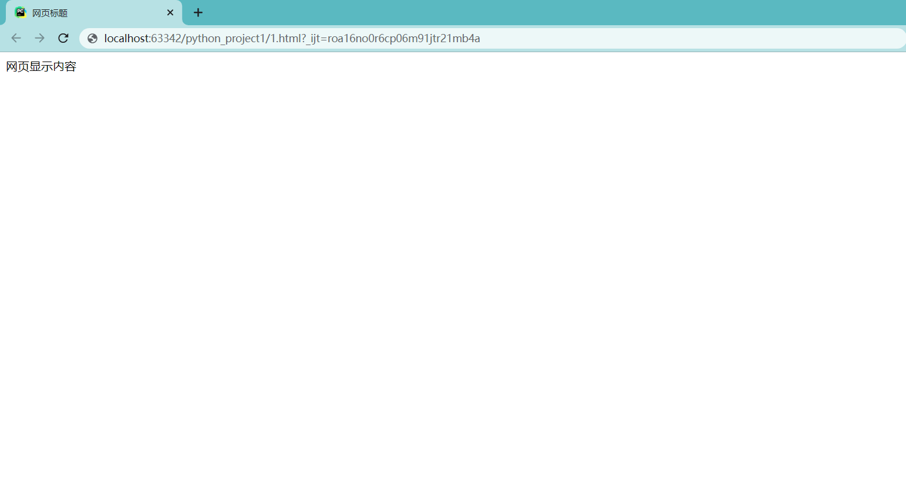
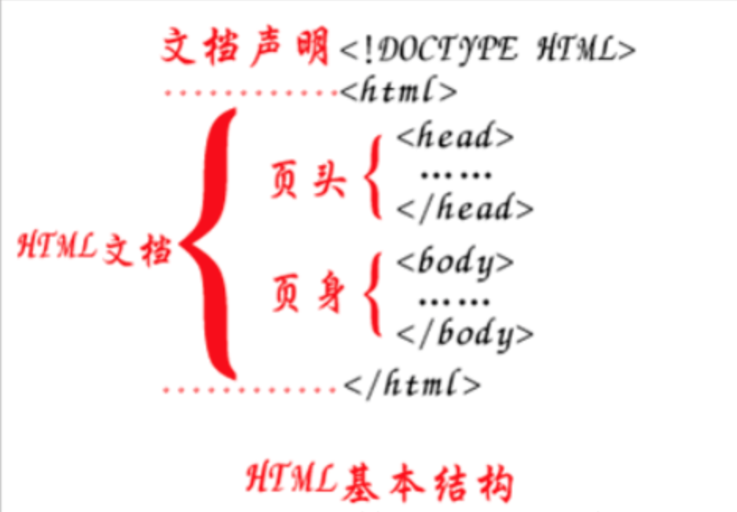

# HTML基础知识

学习目标

- 能够知道html的作用
- 能够写出html的基本结构
- 能够知道单标签和双标签的区别
- 知道相对路径和绝对路径的区别
- 掌握标签的种类
- 了解表格的边线合并
- 了解表单中常用的表单元素标签
- 了解表单的提交方式
- 了解表单中action属性的作用


## 一、HTML的介绍

#### 1. 网页效果图 -- 图灵python


#### 2. html的定义

HTML 的全称为：HyperText Mark-up Language, 指的是超文本标记语言。 

标记：就是标签, <标签名称> </标签名称>, 比如: \<html>\</html>、\<h1>\</h1>等，标签大多数都是成对出现的。

所谓超文本，有两层含义:

1. 因为网页中还可以图片、视频、音频等内容(超越文本限制)
2. 它还可以在网页中跳转到另一个网页，与世界各地主机的网页链接(超链接文本)


#### 3. html的作用

html是用来开发网页的，它是开发网页的语言。


## 二、html 的基本结构

#### 1. 结构代码

```
<!DOCTYPE html>
<html>
    <head>            
        <meta charset="UTF-8">
        <title>网页标题</title>
    </head>
    <body>
          网页显示内容
    </body>
</html>
```


1. 第一行**<!DOCTYPE html>**是文档声明, 用来指定页面所使用的html的版本, 这里声明的是一个html5的文档。
2. **\<html>...\</html>**标签是开发人员在告诉浏览器，整个网页是从**\<html>**这里开始的，到**\</html>**结束,也就是html文档的开始和结束标签。
3. **\<head>...\</head>**标签用于定义文档的头部,是负责对网页进行设置标题、编码格式以及引入css和js文件的。
4. **\<body>...\</body>**标签是编写网页上显示的内容。

#### 2. 浏览网页文件

网页文件的后缀是**.html**或者**.htm**, **一个html文件就是一个网页**，html文件用编辑器打开显示的是文本，可以用文本的方式编辑它，如果用浏览器打开，浏览器会按照标签描述内容将文件渲染成网页。



#### 3. 小结




## 三、初始常用的 html 标签

#### 1. 常用的 html 标签

```
<!-- 1、成对出现的标签：-->

<h1>h1标题</h1>
<div>这是一个div标签</div>
<p>这个一个段落标签</p>


<!-- 2、单个出现的标签： -->
<br>  换行

<hr>  水平线

<!-- 3、带属性的标签，如src、alt 和 href等都是属性 -->

<a href="http://www.baidu.com">百度网</a>

<!-- 4、标签的嵌套 -->
<div>
    
    <a href="http://www.baidu.com">百度网</a>
</div>
```

**提示:**

1. 标签不区分大小写，但是推荐使用小写。
2. 根据标签的书写形式，标签分为双标签(闭合标签)和单标签(空标签)
   2.1 双标签是指由开始标签和结束标签组成的一对标签，这种标签允许嵌套和承载内容，比如: div标签
   2.2 单标签是一个标签组成，没有标签内容， 比如: img标签


#### 2.标签列表

| 标签             | 描述                                       |
| :------------- | ---------------------------------------- |
| \<!--...-->    | 定义注释                                     |
| \<!DOCTYPE>    | 定义文档类型                                   |
| \<a>           | 定义超文本链接                                  |
| \<abbr>        | 定义缩写                                     |
| \<acronym>     | 定义只取首字母的缩写，不支持HTML5                      |
| \<address>     | 定义文档作者或拥有者的联系信息                          |
| \<applet>      | HTML5中不赞成使用。定义嵌入的 applet。                |
| \<area>        | 定义图像映射内部的区域                              |
| \<article>     | 定义一个文章区域                                 |
| \<aside>       | 定义页面的侧边栏内容                               |
| \<audio>       | 定义音频内容                                   |
| \<b>           | 定义文本粗体                                   |
| \<base>        | 定义页面中所有链接的默认地址或默认目标。                     |
| \<basefont>    | HTML5不支持，不赞成使用。定义页面中文本的默认字体、颜色或尺寸。       |
| \<bdi>         | 允许您设置一段文本，使其脱离其父元素的文本方向设置。               |
| \<bdo>         | 定义文字方向                                   |
| \<big>         | 定义大号文本，HTML5不支持                          |
| \<blockquote>  | 定义长的引用                                   |
| \<body>        | 定义文档的主体                                  |
| \<br>          | 定义换行                                     |
| \<button>      | 定义一个点击按钮                                 |
| \<canvas>      | 定义图形，比如图表和其他图像,标签只是图形容器，您必须使用脚本来绘制图形     |
| \<caption>     | 定义表格标题                                   |
| \<center>      | HTML5不支持，不赞成使用。定义居中文本。                   |
| \<cite>        | 定义引用(citation)                           |
| \<code>        | 定义计算机代码文本                                |
| \<col>         | 定义表格中一个或多个列的属性值                          |
| \<colgroup>    | 定义表格中供格式化的列组                             |
| \<command>     | 定义命令按钮，比如单选按钮、复选框或按钮                     |
| \<datalist>    | 定义选项列表。请与 input 元素配合使用该元素，来定义 input 可能的值。 |
| \<dd>          | 定义定义列表中项目的描述                             |
| \<del>         | 定义被删除文本                                  |
| \<details>     | 用于描述文档或文档某个部分的细节                         |
| \<dfn>         | 定义定义项目                                   |
| \<dialog>      | 定义对话框，比如提示框                              |
| \<dir>         | HTML5不支持，不赞成使用。定义目录列表。                   |
| \<div>         | 定义文档中的节                                  |
| \<dl>          | 定义列表详情                                   |
| \<dt>          | 定义列表中的项目                                 |
| \<em>          | 定义强调文本                                   |
| \<embed>       | 定义嵌入的内容，比如插件。                            |
| \<fieldset>    | 定义围绕表单中元素的边框                             |
| \<figcaption>  | 定义<figure> 元素的标题                         |
| \<figure>      | 规定独立的流内容（图像、图表、照片、代码等等）。                 |
| \<font>        | HTML5不支持，不赞成使用。定义文字的字体、尺寸和颜色。            |
| \<footer>      | 定义 section 或 document 的页脚。               |
| \<form>        | 定义了HTML文档的表单                             |
| \<frame>       | 定义框架集的窗口或框架                              |
| \<frameset>    | 定义框架集                                    |
| \<h1> to \<h6> | 定义 HTML 标题                               |
| \<head>        | 定义关于文档的信息                                |
| \<header>      | 定义了文档的头部区域                               |
| \<hr>          | 定义水平线                                    |
| \<html>        | 定义 HTML 文档                               |
| \<i>           | 定义斜体字                                    |
| \<iframe>      | 定义内联框架                                   |
| \         | 定义图像                                     |
| \<input>       | 定义输入控件                                   |
| \<ins>         | 定义被插入文本                                  |
| \<kbd>         | 定义键盘文本                                   |
| \<keygen>      | 规定用于表单的密钥对生成器字段。                         |
| \<label>       | 定义 input 元素的标注                           |
| \<legend>      | 定义 fieldset 元素的标题。                       |
| \<li>          | 定义列表的项目                                  |
| \<link>        | 定义文档与外部资源的关系                             |
| \<main>        | 定义文档的主体部分。                               |
| \<map>         | 定义图像映射                                   |
| \<mark>        | 定义带有记号的文本。请在需要突出显示文本时使用 <em> 标签。         |
| \<menu>        | 不赞成使用。定义菜单列表。                            |
| \<meta>        | 定义关于 HTML 文档的元信息。                        |
| \<meter>       | 定义度量衡。仅用于已知最大和最小值的度量。                    |
| \<nav>         | 定义导航链接的部分                                |
| \<noframes>    | 定义针对不支持框架的用户的替代内容。HTML5不支持               |
| \<noscript>    | 定义针对不支持客户端脚本的用户的替代内容。                    |
| \<object>      | 定义内嵌对象                                   |
| \<ol>          | 定义有序列表。                                  |
| \<optgroup>    | 定义选择列表中相关选项的组合。                          |
| \<option>      | 定义选择列表中的选项。                              |
| \<output>      | 定义不同类型的输出，比如脚本的输出。                       |
| \<p>           | 定义段落。                                    |
| \<param>       | 定义对象的参数。                                 |
| \<pre>         | 定义预格式文本。                                 |
| \<progress>    | 定义运行中的进度（进程）。                            |
| \<q>           | 定义短的引用。                                  |
| \<rp>          | \<rp> 标签在 ruby 注释中使用，以定义不支持 ruby 元素的浏览器所显示的内容。 |
| \<rt>          | \<rt> 标签定义字符（中文注音或字符）的解释或发音。             |
| \<ruby>        | \<ruby> 标签定义 ruby 注释（中文注音或字符）。           |
| \<s>           | 不赞成使用。定义加删除线的文本。                         |
| \<samp>        | 定义计算机代码样本。                               |
| \<script>      | 定义客户端脚本。                                 |
| \<section>     | \<section> 标签定义文档中的节（section、区段）。比如章节、页眉、页脚或文档中的其他部分。 |
| \<select>      | 定义选择列表（下拉列表）。                            |
| \<small>       | 定义小号文本。                                  |
| \<source>      | \<source> 标签为媒介元素（比如 <video> 和 <audio>）定义媒介资源。 |
| \<span>        | 定义文档中的节。                                 |
| \<strike>      | HTML5不支持，不赞成使用。定义加删除线文本。                 |
| \<strong>      | 定义强调文本。                                  |
| \<style>       | 定义文档的样式信息。                               |
| \<sub>         | 定义下标文本。                                  |
| \<summary>     | \<summary> 标签包含 details 元素的标题，"details" 元素用于描述有关文档或文档片段的详细信息。 |
| \<sup>         | 定义上标文本。                                  |
| \<table>       | 定义表格。                                    |
| \<tbody>       | 定义表格中的主体内容。                              |
| \<td>          | 定义表格中的单元。                                |
| \<textarea>    | 定义多行的文本输入控件。                             |
| \<tfoot>       | 定义表格中的表注内容（脚注）。                          |
| \<th>          | 定义表格中的表头单元格。                             |
| \<thead>       | 定义表格中的表头内容。                              |
| \<time>        | 定义日期或时间，或者两者。                            |
| \<template>    | 定义在页面加载时隐藏的一些内容。                         |
| \<title>       | 定义文档的标题。                                 |
| \<tr>          | 定义表格中的行。                                 |
| \<track>       | \<track> 标签为诸如 video 元素之类的媒介规定外部文本轨道。    |
| \<tt>          | 定义打字机文本。                                 |
| \<u>           | 不赞成使用。定义下划线文本。                           |
| \<ul>          | 定义无序列表。                                  |
| \<var>         | 定义文本的变量部分。                               |
| \<video>       | \<video> 标签定义视频，比如电影片段或其他视频流。            |
| \<wbr>         | 规定在文本中的何处适合添加换行符。                        |


#### 3.HTML 属性

| 属性              | 描述                            |
| --------------- | ----------------------------- |
| accesskey       | 设置访问元素的键盘快捷键。                 |
| class           | 规定元素的类名（classname）            |
| contenteditable | 规定是否可编辑元素的内容。                 |
| contextmenu     | 指定一个元素的上下文菜单。当用户右击该元素，出现上下文菜单 |
| data-*          | 用于存储页面的自定义数据                  |
| dir             | 设置元素中内容的文本方向。                 |
| draggable       | 指定某个元素是否可以拖动                  |
| dropzone        | 指定是否将数据复制，移动，或链接，或删除          |
| hidden          | hidden 属性规定对元素进行隐藏。           |
| id              | 规定元素的唯一 id                    |
| lang            | 设置元素中内容的语言代码。                 |
| spellcheck      | 检测元素是否拼写错误                    |
| style           | 规定元素的行内样式（inline style）       |
| tabindex        | 设置元素的 Tab 键控制次序。              |
| title           | 规定元素的额外信息（可在工具提示中显示）          |
| translate       | 指定是否一个元素的值在页面载入时是否需要翻译        |

#### 4.小结

- 学习 html 语言就是学习标签的用法，常用的标签有20多个。
- 编写 html 标签建议使用小写
- 根据书写形式，html 标签分为双标签和单标签
- 单标签没有标签内容，双标签可以嵌套其它标签和承载文本内容


## 四、资源路径

当我们使用img标签显示图片的时候，需要指定图片的资源路径，比如:

```

```

这里的src属性就是设置图片的资源路径的，资源路径可以分为**相对路径和绝对路径**。

#### 1. 相对路径

从当前操作 html 的文档所在目录算起的路径叫做相对路径

**示例代码:**

```
<!-- 相对路径方式1 -->

<!-- 相对路径方式2 -->

```

#### 2. 绝对路径

​    从根目录算起的路径叫做绝对路径，Windows 的根目录是指定的盘符，mac OS 和Linux 是/

**示例代码:**

```
<!-- 绝对路径 -->


```

**提示:**

​     一般都会使用相对路径，绝对路径的操作在其它电脑上打开会有可能出现资源文件找不到的问题


## 五、列表标签

#### 1. 列表标签的种类

- 无序列表标签(ul标签)
- 有序列表标签(ol标签)


#### 2. 无序列表

```
<!-- ul标签定义无序列表 -->
<ul>
    <!-- li标签定义列表项目 -->
    <li>列表标题一</li>
    <li>列表标题二</li>
    <li>列表标题三</li>
</ul>
```


#### 3. 有序列表

```
<!-- ol标签定义有序列表 -->
<ol>
    <!-- li标签定义列表项目 -->
    <li><a href="#">列表标题一</a></li>
    <li><a href="#">列表标题二</a></li>
    <li><a href="#">列表标题三</a></li>
</ol>
```


## 六、表格标签

#### 1. 表格的结构

​	表格是由行和列组成，好比一个excel文件


#### 2. 表格标签

- **\<table>**标签：表示一个表格
  - **\<tr>**标签：表示表格中的一行
    - **\<td>**标签：表示表格中的列
    - **\<th>**标签：表示表格中的表头

**示例代码:**

```
<table border="1" cellspacing="3">
    <tr>
        <th>姓名</th>
        <th>年龄</th>
    </tr>
    <tr>
        <td>张三</td>
        <td>18</td> 
    </tr>
</table>
```

**表格边线合并:**

​	border-collapse 设置表格的边线合并，如：style="border-collapse:collapse";


## 七、表单标签

#### 1. 表单的介绍

​	表单用于搜集不同类型的用户输入(用户输入的数据)，然后可以把用户数据提交到web服务器 。

​	案例：https://www.wjx.cn/jq/17141631.aspx

#### 2. 表单相关标签的使用

1. **\<form>**标签 表示表单标签，定义整体的表单区域
2. **\<label>**标签 表示表单元素的文字标注标签，定义文字标注
3. **\<input>**标签 表示表单元素的用户输入标签，定义不同类型的用户输入数据方式
   - type属性
     - type="text" 定义单行文本输入框
     - type="password" 定义密码输入框
     - type="radio" 定义单选框
     - type="checkbox" 定义复选框
     - type="file" 定义上传文件
     - type="submit" 定义提交按钮
     - type="reset" 定义重置按钮
     - type="button" 定义一个普通按钮
4. **\<textarea>**标签 表示表单元素的多行文本输入框标签 定义多行文本输入框
5. **\<select>**标签 表示表单元素的下拉列表标签 定义下拉列表
   - **\<option>**标签与**\<select>**标签配合，定义下拉列表中的选项

**示例代码:**

```
<form>
    <p>
    	# for 绑定同名的id输入框
        <label>姓名：</label><input type="text">
    </p>
    <p>
        <label>密码：</label><input type="password">
    </p>
    <p>
        <label>性别：</label>
        <input type="radio"> 男
        <input type="radio"> 女
    </p>
    <p>
        <label>爱好：</label>
        <input type="checkbox"> 唱歌
        <input type="checkbox"> 跑步
        <input type="checkbox"> 游泳
    </p>
    <p>
        <label>照片：</label>
        <input type="file">
    </p>
    <p>
        <label>个人描述：</label>
        <textarea></textarea>
    </p>
    <p>
        <label>籍贯：</label>
        <select>
            <option>北京</option>
            <option>上海</option>
            <option>广州</option>
            <option>深圳</option>
        </select>
    </p>
    <p>
        <input type="submit" value="提交">
        <input type="reset" value="重置">
    </p>
</form>
```


#### 3. 小结

- 表单标签是**\<form>**标签
- 常用的表单元素标签有: **\<label>**、**\<input>**、**\<textarea>** 、 **\<select>**等标签


## 八、表单提交

#### 1. 表单属性设置

**\<form>**标签 表示表单标签，定义整体的表单区域

- action属性 设置表单数据提交地址
- method属性 设置表单提交的方式，一般有“GET”方式和“POST”方式, 不区分大小写


#### 2. 表单元素属性设置

- name属性 设置表单元素的名称，该名称是提交数据时的参数名
- value属性 设置表单元素的值，该值是提交数据时参数名所对应的值


#### 3. 示例代码

```
 <form action="https://www.baidu.com" method="GET">
    <p>
        <label>姓名：</label><input type="text" name="username" value="11" />
    </p>
    <p>
        <label>密码：</label><input type="password" name="password" />
    </p>
    <p>
        <label>性别：</label>
        <input type="radio" name="gender" value="0" /> 男
        <input type="radio" name="gender" value="1" /> 女
    </p>
    <p>
        <label>爱好：</label>
        <input type="checkbox" name="like" value="sing" /> 唱歌
        <input type="checkbox" name="like" value="run" /> 跑步
        <input type="checkbox" name="like" value="swiming" /> 游泳
    </p>
    <p>
        <label>照片：</label>
        <input type="file" name="person_pic">
    </p>
    <p>
        <label>个人描述：</label>
        <textarea name="about"></textarea>
    </p>
    <p>
        <label>籍贯：</label>
        <select name="site">
             
            <option value="0">北京</option>
            <option value="1">上海</option>
            <option value="2">广州</option>
            <option value="3">深圳</option>
        </select>
    </p>
    <p>
        <input type="submit" name="" value="提交">
        <input type="reset" name="" value="重置">
    </p>
</form>
```


#### 4.小结

- 表单标签的作用就是可以把用户输入数据一起提交到web服务器。
- 表单属性设置
  - action: 是设置表单数据提交地址
  - method: 是表单提交方式，提交方式有GET和POST
- 表单元素属性设置
  - name: 表单元素的名称，用于作为提交表单数据时的参数名
  - value: 表单元素的值，用于作为提交表单数据时参数名所对应的值