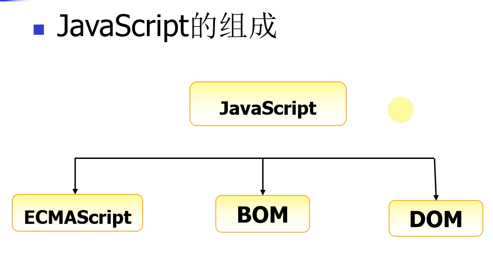
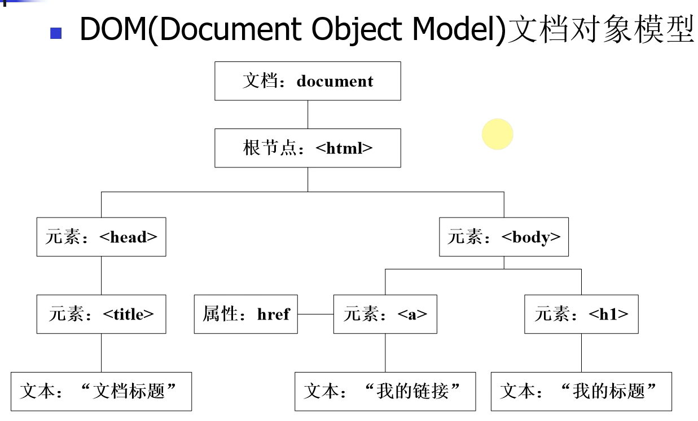
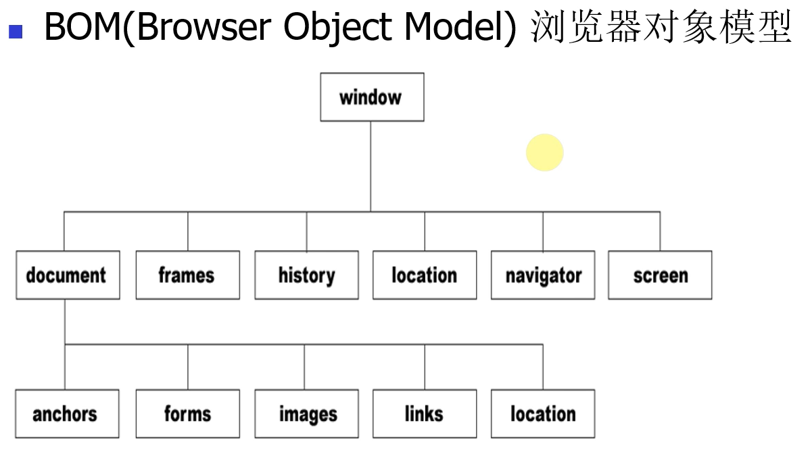

# JavaScript基础知识

**学习目标**

- 能够知道JavaScript的作用
- 能够知道JavaScript的使用方式
- 能够说出常用的数据类型
- 能够写出函数的定义和调用方式
- 能够知道变量的使用范围
- 能够写出多条件判断的条件语句
- 能够写出获取标签元素的操作
- 能够知道获取和设置标签元素属性
- 能够根据下标删除指定元素
- 能够写出2种循环语句
- 能够实现字符串拼接的操作
- 能够实现反复执行的定时器
- 能够知道window对象的常用属性

## 一、JavaScript的介绍

### 1. JavaScript的定义

​	JavaScript是运行在浏览器端的脚步语言, 是由浏览器解释执行的, 简称js, 它能够让网页和用户有交互功能, 增加良好的用户体验效果。

**前端开发三大块** 1、HTML：负责网页结构 2、CSS：负责网页样式 3、JavaScript：负责网页行为， 比如:网页与用户的交互效果

### 2. 小结

- JavaScript是运行在浏览器端的脚步语言，它的作用就是负责网页和用户的交互效果。

  ​

  ​


## 二、JavaScript的使用方式

### 1. 行内式（主要用于事件）

```
<input type="button" name="" onclick="alert('ok！');">
```

### 2. 内嵌式

```
<script type="text/javascript">        
    alert('ok！');
</script>
```

### 3. 外链式

```
<script type="text/javascript" src="js/index.js"></script>
```

### 4. 小结

- JavaScript的使用方式有三种，分别是:
  - 行内式
  - 内嵌式
  - 外链式


## 三、变量和数据类型

### 1. 定义变量

javaScript 是一种弱类型语言，也就是说不需要指定变量的类型，JavaScript的变量类型由它的值来决定， 定义变量需要用关键字 'var', 一条JavaScript语句应该以“;”结尾

**定义变量的语法格式:**

var 变量名 = 值;

```
 var iNum = 123;
 var sTr = 'asd';

 //同时定义多个变量可以用","隔开，公用一个‘var’关键字

 var iNum = 45,sTr='qwe',sCount='68';
```

### 2. JavaScript注释

JavaScript的注释分为单行注释(//注释内容)和多行注释(/*多行注释*/)

```
<script type="text/javascript">    

// 单行注释
var iNum = 123;
/*  
    多行注释
    1、...
    2、...
*/
var sTr = 'abc123';
</script>

```

### 3. 数据类型

js中有六种数据类型，包括五种基本数据类型和一种复杂数据类型(object)。

5种基本数据类型：
1、number 数字类型
2、string 字符串类型
3、boolean 布尔类型 true 或 false
4、undefined undefined类型，变量声明未初始化，它的值就是undefined
5、null null类型，表示空对象，如果定义的变量将来准备保存对象，可以将变量初始化为null,在页面上获取不到对象，返回的值就是null

1种复合类型：
1、object 后面学习的**数组、函数和JavaScript对象**都属于复合类型

```
//1.1 数字 number
var iOne = 10.1;

//1.2 字符串 string
var sStr = '1234';

//1.3 布尔 boolean; 
var bIsTrue = false;

//1.4 未定义 undefined
var unData;

//1.5 null 表示空对象
var nullData = null;
//因为在 JS 的最初版本中，使用的是 32 位系统，为了性能考虑使用低位存储了变量的类型信息，000 开头代表是对象，然而 null 表示为全零，所以将它错误的判断为 object 。虽然现在的内部类型判断代码已经改变了，但是对于这个 Bug 却是一直流传下来。

//1.6 object 表示对象类型
var oObj = {
   name:"隔壁老王",
   age:88
}
// 获取变量的类型
var type = typeof(oObj);
alert(type);
// 获取对象的name属性
alert(oObj.name);
```

### 4. 变量命名规范

1、区分大小写
2、第一个字符必须是字母、下划线（_）或者美元符号（$）
3、其他字符可以是字母、下划线、美元符或数字

### 5. 匈牙利命名风格

对象o Object 比如：oDiv
数组a Array 比如：aItems
字符串s String 比如：sUserName
整数i Integer 比如：iItemCount
布尔值b Boolean 比如：bIsComplete
浮点数f Float 比如：fPrice
函数fn Function 比如：fnHandler

### 6. 小结

- js中有六种数据类型，分别是:
  - number
  - string
  - boolean
  - undefined
  - null
  - object

## 四、函数定义和调用

### 1. 函数定义

函数就是可以**重复使用的代码块**, 使用关键字 **function** 定义函数。

```
<script type="text/javascript">
    // 函数定义
    function fnAlert(){
        alert('hello!');
    }
</script>
```

### 2. 函数调用

函数调用就是**函数名加小括号**，比如:函数名(参数[参数可选])

```
<script type="text/javascript">
    // 函数定义
    function fnAlert(){
        alert('hello!');
    }
    // 函数调用
    fnAlert();
</script>
```

### 3. 定义有参数有返回值的函数

定义函数时，函数如果有参数，**参数放到小括号里面**，函数如果有返回值，返回值通过 **return** 关键字来返回

```
<script type="text/javascript">
function fnAdd(iNum01,iNum02){
    var iRs = iNum01 + iNum02;
    return iRs;
    alert('here!');
}

var iCount = fnAdd(3,4);
alert(iCount);  //弹出7
</script>

```

**函数中'return'关键字的作用:**
1、返回函数中的值
2、执行完return函数执行结束

### 4. 小结

- 函数的定义

  ```
    function 函数名(参数[参数可选]){  
        // 函数的代码实现  
        ...  
    }
  ```

- 函数的调用

  ```
    函数名(参数[参数可选])
  ```


## 五、变量作用域

### 1. 变量作用域的介绍

变量作用域就是变量的使用范围，变量分为:

- 局部变量
- 全局变量

### 2. 局部变量

局部变量就是在函数内使用的变量，只能在函数内部使用。

```
<script type="text/javascript">
    function myalert()
    {
        // 定义局部变量
        var b = 23;
        alert(b);
    }
    myalert(); // 弹出23
    alert(b);  // 函数外使用出错
</script>

```

### 3. 全局变量

全局变量就是在函数外定义的变量，可以在不同函数内使用。

```
<script type="text/javascript">
    // 定义全局变量
    var a = 12;
    function myalert()
    {
        // 修改全局变量
        a++;
    }
    myalert();
    alert(a);  // 弹出13    
</script>
```

### 4. 小结

- 局部变量只能在函数内部使用
- 全局变量可以在不同函数内使用


## 六、条件语句

### 1. 条件语句的介绍

条件语句就是通过条件来控制程序的走向

### 2. 条件语句语法

1. if 语句 - 只有当指定条件为 true 时，使用该语句来执行代码
2. if...else 语句 - 当条件为 true 时执行代码，当条件为 false 时执行其他代码
3. if...else if....else 语句 - 使用该语句来判断多条件，执行条件成立的语句

### 3. 比较运算符

假如 x = 5, 查看比较后的结果:

| 比较运算符 | 描述       | 例子                                |
| ----- | -------- | --------------------------------- |
| ==    | 等于       | x == 8 为 false                    |
| ===   | 全等(值和类型) | x === 5 为 true; x === "5" 为 false |
| !=    | 不等于      | x != 8 为 true                     |
| >     | 大于       | x > 8 为 false                     |
| <     | 小于       | x < 8 为 true                      |
| >=    | 大于或等于    | x >= 8 为 false                    |
| <=    | 小于或等于    | x <= 8 为 true                     |

**比较运算符示例代码:**

```
var iNum01 = 12;
var sNum01 = '12';

if(iNum01==12){
    alert('相等！');
}
else{
    alert('不相等！')
}

// "==" 符号默认会将符号两边的变量转换成数字再进行对比，这个叫做隐式转换
if(sNum01==12){
    alert('相等！');
}
else{
    alert('不相等！')
}

// "===" 符号不会转换符号两边的数据类型
if(sNum01===12){
    alert('相等！');
}
else{
    alert('不相等！')
}

// 多条件判断
var sFruit = "苹果";
if (sFruit == "苹果") {
    alert("您选择的水果是苹果");
} else if (sFruit == "鸭梨") {
    alert("您选择的水果是鸭梨");
} else {
    alert("对不起，您选择的水果不存在!")
}

```

### 4. 逻辑运算符

假如 x=6, y=3, 查看比较后的结果:

| 比较运算符 | 描述   | 例子                       |
| ----- | ---- | ------------------------ |
| &&    | and  | (x < 10 && y > 1) 为 true |
| \|\|  | or   | (x==5 \|\| y==5) 为 false |
| !     | not  | !(x==y) 为 true           |

**逻辑运算符示例代码:**

```
var x = 6;
var y = 3;

if(x < 10 && y > 1){
    alert('都大于');
}
else{
    alert('至少有一个不大于');
}

if(x > 5 || y > 7 ){
    alert('至少有一个大于');
}
else{
    alert('都不大于');
}

if(!(x == y)){
    alert('等于')
}
else{
    alert('不等于')
}

```

### 5. 小结

- 条件语句三种写法
  - if 语句 适用于单条件判断
  - if else 语句 适用于两种条件的判断(成立和不成立条件判断)。
  - if else if else 语句 适用于多条件判断


## 七、获取标签元素

### 1. 获取标签元素

可以使用**内置对象 document **上的 **getElementById 方法**来获取页面上设置了id属性的标签元素，获取到的是一个html对象，然后将它赋值给一个变量，比如：

```
<script type="text/javascript">
    var oDiv = document.getElementById('div1');
    alert(oDiv);
</script>
<div id="div1">这是一个div元素</div>
```

**说明:**
上面的代码，如果把javascript写在元素的上面，就会出错，因为页面上从上往下加载执行的，javascript去页面上获取元素div1的时候，元素div1还没有加载。

**解决方法有两种:**

第一种方法：将javascript放到页面最下边

```
<div id="div1">这是一个div元素</div>

<script type="text/javascript">
    var oDiv = document.getElementById('div1');
    alert(oDiv);
</script>

```

第二种方法：设置页面加载完成执行的函数，在执行函数里面获取标签元素。

```
<script type="text/javascript">
    window.onload = function(){
        var oDiv = document.getElementById('div1');
    }
</script>
```

**说明:**
onload是页面所有元素加载完成的事件，给onload设置函数时，当事件触发就会执行设置的函数。

### 2. 小结

- 获取标签元素需要等待页面加载完成，使用**document.getElementById('标签id');**


##  八、操作标签元素属性

### 1. 属性的操作

首先获取的页面标签元素，然后就可以对页面标签元素的属性进行操作，属性的操作包括:

- 属性的读取
- 属性的设置

**属性名在js中的写法**

1. html的属性和js里面属性大多数写法一样，但是“class” 属性写成 “className”
2. “style” 属性里面的属性，有横杠的改成驼峰式，比如：“font-size”，改成”style.fontSize”

```
<style>
    .sty01{
        font-size:20px;
        color:red;
    }
    .sty02{
        font-size:30px;
        color:pink;
        text-decoration:none;
    }

</style>

<script type="text/javascript">

    window.onload = function(){
        var oInput = document.getElementById('input1');
        var oA = document.getElementById('link1');
        // 读取属性值
        var sValue = oInput.value;
        var sType = oInput.type;
        var sName = oInput.name;
        var sLinks = oA.href;

        // 操作class属性,需要写成“className”
        oA.className = 'sty02';

        // 写(设置)属性
        oA.style.color = 'red';
        oA.style.fontSize = sValue;
    }

</script>

<input type="text" name="setsize" id="input1" value="20px">
<a href="#" id="link01" class="sty01">这是一个链接</a>
```

### 2. innerHTML

innerHTML可以读取或者设置标签包裹的内容

```
<script type="text/javascript">
    window.onload = function(){
        var oDiv = document.getElementById('div1');
        //读取
        var sTxt = oDiv.innerHTML;
        alert(sTxt);
        //写入
        oDiv.innerHTML = '<a href="https://bobin.ke.qq.com/?tuin=66fe657f">图灵教育<a/>';
    }
</script>


<div id="div1">这是一个div元素</div>
```

### 3. 小结

标签属性的获取和设置:

1. var 标签对象 = document.getElementById('id名称'); -> 获取标签对象
2. var 变量名 = 标签对象.属性名 -> 读取属性
3. 标签对象.属性名 = 新属性值 -> 设置属性


## 九、数组及操作方法

### 1. 数组的介绍

数组就是一组数据的集合，javascript 中，数组里面的数据可以是不同类型的数据，好比 python 里面的列表。

### 2. 数组的定义

```
// 实例化对象方式创建
var aList = new Array(1,2,3);

// 字面量方式创建，推荐使用
var aList2 = [1,2,3,'asd'];
```

### 3. 多维数组

多维数组指的是数组的成员也是数组，把这样的数组叫做多维数组。

```
var aList = [[1,2,3],['a','b','c']];

```

### 4. 数组的操作

1、 获取数组的长度

```
var aList = [1,2,3,4];
alert(aList.length); // 弹出4

```

2、 根据下标取值

```
var aList = [1,2,3,4];
alert(aList[0]); // 弹出1

```

3、 从数组最后添加和删除数据

```
var aList = [1,2,3,4];
aList.push(5);
alert(aList); //弹出1,2,3,4,5
aList.pop();
alert(aList); // 弹出1,2,3,4

```

4、根据下标添加和删除元素

arr.splice(start,num,element1,.....,elementN)

参数解析：

1. start：必需，开始删除的索引。
2. num：可选，删除数组元素的个数。
3. elementN：可选，在start索引位置要插入的新元素。

此方法会删除从start索引开始的num个元素，并将elementN参数插入到start索引位置。

```
var colors = ["red", "green", "blue"];
colors.splice(0,1);  //删除第一项
alert(colors);  //green,blue

colors.splice(1, 0, "yellow", "orange");  //从第一个索引位置插入两项数据
alert(colors);  //green,yellow,organge,blue

colors.splice(1, 1, "red", "purple");  //删除一项，插入两项数据
alert(colors);  //green,red,purple,orange,blue

```

### 5. 小结

- 数组的定义使用一对中括号
- 获取数组的长度使用length属性
- 从数组最后添加元素使用push方法
- 从数组最后删除元素使用pop方法
- 根据下标添加和删除元素使用splice方法


## 十、循环语句

### 1. 循环语句的介绍

循环语句就是让一部分代码重复执行，javascript中常用的循环语句有:

- for
- while
- do-while

### 2. for循环

```
var array = [1, 4, 5];

for(var index = 0; index < array.length; index++){
    result = array[index];
    alert(result);
}

```

### 3. while循环

```
var array = [1, 4, 5];        
var index = 0;

while (index < array.length) {
    result = array[index];
    alert(result);
    index++;
}
```

**说明:**

当条件成立的时候, while语句会循环执行

### 4. do-while循环

```
var array = [1, 4, 5];
var index = 0;

do {
    result = array[index];
    alert(result);
    index++;
} while (index < array.length);
```

**说明:**

当条件不成立的时候do语句也会执行一次

### 5. 小结

- js中循环语句有:
  - for
  - while
  - do-while


## 十一、字符串拼接

### 1、字符串拼接

字符串拼接使用: **"+"** 运算符

```
var iNum1 = 10;
var fNum2 = 11.1;
var sStr = 'abc';

result = iNum1 + fNum2;
alert(result); // 弹出21.1

result = fNum2 + sStr;
alert(result); // 弹出11.1abc
```

**说明**

数字和字符串拼接会自动进行类型转换(隐士类型转换)，把数字类型转成字符串类型进行拼接

### 小结

- **"+"** 运算符能够实现字符串的拼接操作


## 十二、对象

### 1.什么是对象

现实生活中:万物皆对象，对象是一个具体的事物，看得见摸得着的实物。例如，一本书、一辆汽车、一个人可以是“对象”，一个数据库、一张网页、一个与远程服务器的连按也可以是“对象”。

在JavaScript 中，对象是一组无序的相关属性和方法的集合，所有的事物都是对象，例如字符串、数值、数组.函数等。

对象是由属性和方法组成的。

- 属性:事物的特征，在对象中用属性来表示(常用名词)
- 方法:事物的行为，在对象中用方法来表示(常用动词)

### 2.创建对象的三种方式

- 利用字面量创建对象
- 利用new object创建对象
- 利用构造函数创建对象

#### 1.利用字面量创建对象

对象字面量:就是花括号里面包含了表达这个具体事物(对象)的属性和方法

```
<script>
// 利用对象字面量创建对象 {}
// var obj = ; 
// 创建了一个空的对象
var obj = (
	uname:张三疯'
	age: 18
	sex:男'， I
	sayHi: function(){
      console.log('hello world')
	}
	// (1) 里面的属性或者方法我们采取键值对的形式 键 属性名 : 值 属性值
	// (2) 多个属性或者方法中间用逗号隔开的
	// (3) 方法冒号后面跟的是一个匿名函数
	// 2.使用对象
	// (1).调用对象的属性 我们采取 对象名.属性名 
	// (2). 调用属性还有一种方法 对象名["属性名"]
	// (3).调用对象的方法   对象名.方法名()
</script>
```

#### 2.利用new object创建对象

```
<script>
// 利用 new object 创建对象
var obj = new object(); 
// 创建了一个空的对象
obj.uname =张三疯';
obj.age = 18;
obj.sex ='男';
obj.sayHi = function(){
	console.log("hi~');
	}
	//(1) 我们是利用 等号 = 赋值的方法 添加对象的属性和方法
	// (2) 每个属性和方法之间用 分号结束
</script>
```

#### 3.利用构造函数创建对象

为什么要通过构造函数创建对象？

​	因为我们前面两种创建对象的方式一次只能创建一个对象，里面很多的属性和方法是大量相同的 我们只能复制

​	因此我们可以利用函数的方法 重复这些相同的代码 我们就把这个函数成为**构造函数**

**构造函数**:是一种特殊的函数，主要用来初始化对象，即为对象成员变量赋初始值，它总与new 运算符一起使用。我们可以把对象中一些公共的属性和方法抽取出来，然后封装到这个函数里面。

​	

```
<script>
//利用构造函数创建对象
//我们需要创建四大天王的对象相同的属性: 名字 年龄 性别 相同的方法:唱歌
//构造函数的语法格式
// function 构造函数名(){
//	this.属性 = 值;
//	this.方法 = function()}
//	}

// new 构造函数名();

function Star(uname, age, sex){ 
	this.name = uname;
	this.age = age;
	this.sex = sex;
	this.sing = function (sang) {
        console.log(sang)
    }
	}
var ldh = new Star("刘德华",18, "男");
console.log(typeof ldh);
console.log(ldh.age);
console.log(ldh['name']);
ldh.sing('冰雨');


</script>
```

### 3.遍历对象

语法：for(var 临时变量 in 遍历的对象){}

```
<script>
function Star(uname, age, sex){
	this.name = uname;
	this.age = age;
	this.sex = sex;
	this.sing = function (sang) {
        console.log(sang)
    }
	}
var ldh = new Star("刘德华",18, "男");
console.log(typeof ldh);
console.log(ldh.age);
console.log(ldh['name']);
ldh.sing('冰雨');

for (var k in ldh){
    console.log(k)
    console.log(ldh[k])
}


</script>
```


## 十三、定时器

### 1. 定时器的介绍

定时器就是在一段特定的时间后执行某段程序代码。

### 2. 定时器的使用：

js 定时器有两种创建方式：

1. setTimeout(func[, delay, param1, param2, ...]) ：以指定的时间间隔（以毫秒计）调用一次函数的定时器
2. setInterval(func[, delay, param1, param2, ...]) ：以指定的时间间隔（以毫秒计）重复调用一个函数的定时器

**setTimeout函数的参数说明:**

- 第一个参数 func , 表示定时器要执行的函数名
- 第二个参数 delay, 表示时间间隔，默认是0，单位是毫秒
- 第三个参数 param1, 表示定时器执行函数的第一个参数，一次类推传入多个执行函数对应的参数。

```
<script> 
    function hello(){ 
        alert('hello'); 
    } 

    // 执行一次函数的定时器
    setTimeout(hello, 500);
</script>
```

**setInterval函数的参数说明:**

- 第一个参数 func , 表示定时器要执行的函数名
- 第二个参数 delay, 表示时间间隔，默认是0，单位是毫秒
- 第三个参数 param1, 表示定时器执行函数的第一个参数，一次类推传入多个执行函数对应的参数。

```
<script> 
    function hello(){ 
        alert('hello'); 
    } 
    // 重复执行函数的定时器
    setInterval(hello, 1000);
</script>

```

### 2. 清除定时器

js 清除定时器分别是:

- clearTimeout(timeoutID) 清除只执行一次的定时器(setTimeout函数)
- clearInterval(timeoutID) 清除反复执行的定时器(setInterval函数)

**clearTimeout函数的参数说明:**

- timeoutID 为调用 setTimeout 函数时所获得的返回值，使用该返回标识符作为参数，可以取消该 setTimeout 所设定的定时执行操作。

```
<script>
    function hello(){
        alert('hello');
        
    }
    // 执行一次函数的定时器
    t1 = setTimeout(hello, 500);
    // 清除只执行一次的定时器
        clearTimeout(t1)
</script>
```

**clearInterval函数的参数说明:**

- timeoutID 为调用 setInterval 函数时所获得的返回值，使用该返回标识符作为参数，可以取消该 setInterval 所设定的定时执行操作。

```
<script> 
    function hello(){ 
        alert('hello'); 
    } 
    // 重复执行函数的定时器
    var t1 = setInterval(hello, 1000);

    function stop(){
        // 清除反复执行的定时器
        clearInterval(t1); 
    }  

</script> 

<input type="button" value="停止" onclick="stop();">
```

### 5. 小结

- 定时器的创建
  - 只执行一次函数的定时器, 对应的代码是setTimeout函数
  - 反复执行函数的定时器, 对应的代码是setInterval函数
- 清除定时器
  - 清除只执行一次函数的定时器, 对应的代码是clearTimeout函数
  - 清除清除反复执行的定时器, 对应的代码是clearInterval函数


## 十四、浏览器window对象属性


###  1.JavaScript的组成




JavaScript可以分为三个部分：[ECMAScript](https://so.csdn.net/so/search?q=ECMAScript&spm=1001.2101.3001.7020)标准、DOM、BOM。

- ECMAScript标准

  ​	即JS的基本语法，JavaScript的核心，描述了语言的基本语法和数据类型，ECMAScript是一套标准，定义了一种语言的标准与具体实现无关。

  ​

- DOM

  即文档对象模型，Document Object Model，用于操作页面元素，DOM可以把HTML看做是文档树，通过DOM提供的API可以对树上的节点进行操作。

  

- BOM
  即浏览器对象模型，Browser Object Model，用于操作浏览器，比如：弹出框、控制浏览器跳转、获取分辨率等。



### 2.docment常见属性对象

​	document对象其实是window对象下的一个子对象，它操作的是HTML文档里所有的内容。事实上，浏览器每次打开一个窗口，就会为这个窗口生成一个window对象，并且会为这个窗口内部的页面（即HTML文档）自动生成一个document对象，然后我们就可以通过document对象来操作页面中所有的元素。

| 属性                                | 说明                  |
| :-------------------------------- | ------------------- |
| document.title                    | 获取文档的title          |
| document.forms                    | 获取所有form元素          |
| document.images                   | 获取所有img元素           |
| document.links                    | 获取所有a元素             |
| document.cookie                   | 文档的cookie           |
| document.URL                      | 当前文档的URL            |
| document.referrer                 | 返回使浏览者到达当前文档的URL    |
| document.write                    | 页面载入过程中，用脚本加入新的页面内容 |
| document.getElementById()         | 通过id获取元素            |
| document.getElementsByTagName()   | 通过标签名获取元素           |
| document.getElementsByClassName() | 通过class获取元素         |
| document.getElementsByName()      | 通过name获取元素          |
| document.querySelector()          | 通过选择器获取元素，只获取第1个    |
| document.querySelectorAll()       | 通过选择器获取元素，获取所有      |
| document.createElement()          | 创建元素节点              |
| document.createTextNode()         | 创建文本节点              |
| document.write()                  | 输出内容                |
| document.writeln()                | 输出内容并换行             |
|                                   |                     |

​	

**代码演示**

```

<Script>
  console.log(document.forms);
  console.log(document.body);
  console.log(document.links);
  console.log(document.images);
  document.write('你的网址是' + document.URL);
  document.write('12342345345')
</Script>


<form action="">
    <lable>你好</lable>
    <input type="text">

</form>
123123423
<div>21334</div>
<a href="">数据</a>
<a href="">新浪</a>
<a href="">百度</a>


```


**注意**：由于window对象是包括document对象的，所以我们可以“简单”地把BOM和DOM的关系理解成：BOM包含DOM。只不过对于文档操作来说，我们一般不把它看成是BOM的一部分，而是看成独立的，也就是DOM。


### 3.window对象的navigator属性

​	window.navigator返回一个navigator对象的引用,可以用它来查询一些关于运行当前脚本的应用程序的相关信息.

| 方法                      | 说明        |
| ----------------------- | --------- |
| navigator.appCodeName   | 浏览器代号     |
| navigator.appName       | 浏览器名称     |
| navigator.appVersion    | 浏览器版本     |
| navigator.cookieEnabled | 启用Cookies |
| navigator.platform      | 硬件平台      |
| navigator.userAgent     | 用户代理      |
| navigator.language      | 用户代理语言    |

**代码示例**

```
        <Script>

    txt = "<p>浏览器代号: " + navigator.appCodeName + "</p>";
    txt+= "<p>浏览器名称: " + navigator.appName + "</p>";
    txt+= "<p>浏览器版本: " + navigator.appVersion + "</p>";
    txt+= "<p>启用Cookies: " + navigator.cookieEnabled + "</p>";
    txt+= "<p>硬件平台: " + navigator.platform + "</p>";
    txt+= "<p>用户代理: " + navigator.userAgent + "</p>";
    txt+= "<p>用户代理语言: " + navigator.language + "</p>";
    document.write(txt);

        </Script>
```


### 4.Window对象的Location属性

window.location 对象用于获得当前页面的地址 (URL)，并把浏览器重定向到新的页面。

**window.location** 对象在编写时可不使用 window 这个前缀


- location.hostname 返回 web 主机的域名
- location.pathname 返回当前页面的路径和文件名
- location.port 返回 web 主机的端口 （80 或 443）
- location.protocol 返回所使用的 web 协议（http: 或 https:）
- window.location.href='http://www.baidu.com'  重定向到百度

### 5.Window frames 属性

frames 属性返回窗口中所有命名的框架。


### 6.window history属性

BOM中的window对象通过window.history方法提供了对浏览器历史记录的读取，让你可以在用户的访问记录中前进和后退。

使用back(),forward(),和go()方法可以在用户的历史记录中前进和后退


### 7.Window Screen属性

window.screen 对象包含有关用户屏幕的信息。

**window.screen**对象在编写时可以不使用 window 这个前缀。

一些属性：

- screen.availWidth - 可用的屏幕宽度
- screen.availHeight - 可用的屏幕高度


