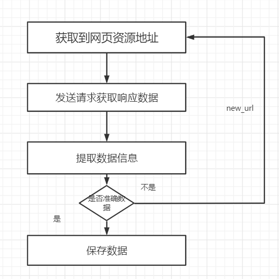

# 爬虫基本知识

#### 学习目标

1. 了解 爬虫的概念
2. 了解 爬虫分类
3. 掌握 爬虫流程
4. 掌握 HTTP基本原理
5. 熟练的使用浏览器开发者工具
6. socket发送网络请求


## 一、爬虫的概念

### 1为什么要学习爬虫

​	如今我们所处的时代就是一个大数据时代，很多公司都在开展相关数据业务，但是人工智能，大数据中有一个至关重要的东西，那就是数据，但是我们的数据从哪里来呢？

#### 1.1数据的来源

- 去第三方的公司购买数据(比如企查查)
- 去免费的数据网站下载数据(比如国家统计局)
- 通过爬虫爬取数据
- 人工收集数据(比如问卷调查)

在上面的来源中：人工的方式费时费力，免费的数据网站上的数据质量不佳，很多第三方的数据公司他们的数据来源往往也是爬虫获取的，所以获取数据最有效的途径就是通过爬虫爬取


#### 1.2爬取到的数据用途

- 进行在网页或者是app上进行展示

[今日热榜](https://tophub.today/)，一家并不是做新闻的公司，这个网站上的新闻数据从哪里来的呢？


通过点击，我们可以发现，他的新闻数据都是其他网站上的，在今日热榜上仅仅做了展示

如果后续我们要做一个网站，IT新闻热榜，是不是也可以这样做呢

- 进行数据分析或者是机器学习相关的项目


### 2.什么是爬虫

网络爬虫（又被称为网页蜘蛛，网络机器人）就是模拟浏览器发送网络请求，接收请求响应，一种按照一定的规则，自动地抓取互联网信息的程序。

原则上,只要是浏览器(客户端)能做的事情，爬虫都能够做


## 二、爬虫的分类与爬虫的流程

###  1.爬虫的分类

根据被爬网站的数量的不同，我们把爬虫分为：

- 通用爬虫 ：通常指搜索引擎的爬虫（[https://www.baidu.com）](https://www.baidu.com）)
- 聚焦爬虫 ：针对特定网站的爬虫


### 2.爬虫的流程

爬虫的工作流程




- 2.1获取到资源地址

```
爬虫首先要做的工作就是获取数据的资源地址，有了准确的地址之后我们才能数据去进行发送请求
```

- 2.2发送请求获取数据 

```
第二步要做的工作就是获取网页，这里就是获取网页的源代码。源代码里包含了网页的部分有用信息，所以 只要把源代码获取下来，就可以从中提取想要的信息了。
```

- 2.3提取信息

```
获取网页源代码后，接下来就是分析网页源代码，从中提取我们想要的数据。首先，最通用的方法便是采用正则表达式提取，这是一个万能的方法，但是在构造正则表达式时比较复杂且容易出错。 另外，由于网页的结构有一定的规则，所以还有一些根据网页节点属性、CSS选择器或 XPath来提取网页信息的库，如Beautiful Soup、pyquery、lxml 等。使用这些库，我们可以高效快速地从中提取网页信 息，如节点的属性、文本值等。 提取信息是爬虫非常重要的部分，它可以使杂乱的数据变得条理清晰，以便我们后续处理和分析数据。
```

- 2.4保存数据

```
提取信息后，我们一般会将提取到的数据保存到某处以便后续使用。这里保存形式有多种多样，如可以简单保 存为 TXT 文本或 JSON 文本，也可以保存到数据库，如 MySQL 和 MongoDB 等，也可保存至远程服务 器，如借助 SFTP 进行操作等。
```


## 三、HTTP基本原理

### 1、 URL

```
URL 的全称为 Universal Resource Locator，即统一资源定位符。

列子：
https://www.baidu.com/item/10056474?fr=aladdin http://IP:port/资源路径/?wd=python#flg 
协议 ：这代表网页使用的请求协议

域名部分：该URL的域名部分为“www.baidu.com”。一个URL中，也可以使用IP地址作为域名使用：202.108.22.5

端口部分：跟在域名后面的是端口，域名和端口之间使用“:”作为分隔符。端口不是一个URL必须的部分，如果省略端口部分。

资源部分：从域名后的最后一个“/”开始到“？”为止，是资源部分

查询参数：从“？”开始到“#”为止之间的部分为参数部分，又称搜索部分、查询部分

```


###  2、超文本

```
其英文名称叫作 hypertext，我们在浏览器里看到的网页就是超文本解析而成的，其网页源代码是一系列 HTML 代码，里面包含了一系列标签，比如 img 显示图片，p 指定显示段落等。浏览器解析这些标签后，便形成了我们平常看到的网页，而网页的源代码 HTML 就可以称作超文本
```


### 3、HTTP和HTTPS

```
在百度的首页 https://www.baidu.com/，中，URL 的开头会有 http 或 https，这个就是访问资源需 要的协议类型，有时我们还会看到 ftp、sftp、smb 开头的 URL，那么这里的 ftp、sftp、smb 都是指 的协议类型。在爬虫中，我们抓取的页面通常就是 http 或 https 协议的，我们在这里首先来了解一下这 两个协议的含义。
```

- HTTP 的全称是 Hyper Text Transfer Protocol，中文名叫做超文本传输协议
  - 超文本传输协议
  - 默认端口号:80
- HTTPS 的全称是 Hyper Text Transfer Protocol over Secure Socket Layer，是以安全为目标的
  - HTTP + SSL(安全套接字层)，即带有安全套接字层的超本文传输协议
  - 默认端口号：443
- HTTP 通道，简单讲是 HTTP 的安全版，即 HTTP 下加入 SSL 层，简称为 HTTPS


### 4、HTTP的前世今生


### 5、HTTP的请求过程


1. 浏览器先向地址栏中的url发起请求，并获取相应
2. 在返回的响应内容（html）中，会带有css、js、图片等url地址，以及ajax代码，浏览器按照响应内容中的顺序依次发送其他的请求，并获取相应的响应
3. 浏览器每获取一个响应就对展示出的结果进行添加（加载），js，css等内容会修改页面的内容，js也可以重新发送请求，获取响应
4. 从获取第一个响应并在浏览器中展示，直到最终获取全部响应，并在展示的结果中添加内容或修改————这个过程叫做浏览器的**渲染**

**注意:**

但是在爬虫中，爬虫只会请求url地址，对应的拿到url地址对应的响应（该响应的内容可以是html，css，js，图片等）

浏览器渲染出来的页面和爬虫请求的页面很多时候并不一样

**所以在爬虫中，需要以url地址对应的响应为准来进行数据的提取**


## 四、HTTP请求的形式

```
请求，由客户端向服务端发出，可以分为 4 部分内容：请求方法（Request Method）、请求的网址 （Request URL）、请求头（Request Headers）、请求体（Request Body）。
```


如何能访问到当前这些数据信息-网页调试工具

### 1、面板组成


### 2、请求方法

作用：让协议清楚的知道，客户端发送了一个什么类型的‘动作指令’

| 方 法     | 描 述                                |
| :------ | ---------------------------------- |
| GET     | 请求页面，并返回页面内容                       |
| HEAD    | 类似于 GET 请求，只不过返回的响应中没有具体的内容，用于获取报头 |
| POST    | 大多用于提交表单或上传文件，数据包含在请求体中            |
| PUT     | 从客户端向服务器传送的数据取代指定文档中的内容            |
| DELETE  | 请求服务器删除指定的页面                       |
| CONNECT | 把服务器当作跳板，让服务器代替客户端访问其他网页           |
| OPTIONS | 允许客户端查看服务器的性能                      |
| TRACE   | 回显服务器收到的请求，主要用于测试或诊断               |


### 3、请求的网址

请求的网址，即统一资源定位符 URL，它可以唯一确定我们想请求的资源。

### 4、请求头

| Host                      | (主机和端口号)                        |
| ------------------------- | ------------------------------- |
| Connection                | (链接类型)                          |
| Upgrade-Insecure-Requests | (升级为HTTPS请求)                    |
| User-Agent                | (浏览器名称)                         |
| Accept                    | (传输文件类型)                        |
| Referer                   | (页面跳转处)                         |
| Accept-Encoding           | （文件编解码格式）                       |
| Cookie                    | （Cookie）                        |
| x-requested-with          | XMLHttpRequest (表示该请求是Ajax异步请求) |


### 5、请求体

请求体一般承载的内容是 POST 请求中的表单数据，而对于 GET 请求，请求体则为空。


### 6、响应

```
响应，由服务端返回给客户端，可以分为三部分：响应状态码（Response Status Code）、响应头 （Response Headers）和响应体（Response Body）。
```

1. 响应状态码

   响应状态码表示服务器的响应状态，如 200 代表服务器正常响应，404 代表页面未找到，500 代表服务器内部发生错误。在爬虫中，我们可以根据状态码来判断服务器响应状态，如状态码为 200，则证明成功返回数据，再进行进一步的处理，否则直接忽略。

2. 常见的状态码及其原因

   | 状态码  |    说 明     |                详 情                |
   | :--- | :--------: | :-------------------------------: |
   | 100  |     继续     | 请求者应当继续提出请求。服务器已收到请求的一部分，正在等待其余部分 |
   | 101  |    切换协议    |     请求者已要求服务器切换协议，服务器已确认并准备切换     |
   | 200  |     成功     |            服务器已成功处理了请求            |
   | 201  |    已创建     |         请求成功并且服务器创建了新的资源          |
   | 202  |    已接受     |          服务器已接受请求，但尚未处理           |
   | 203  |   非授权信息    |    服务器已成功处理了请求，但返回的信息可能来自另一个源     |
   | 204  |    无内容     |       服务器成功处理了请求，但没有返回任何内容        |
   | 205  |    重置内容    |         服务器成功处理了请求，内容被重置          |
   | 206  |    部分内容    |           服务器成功处理了部分请求            |
   | 300  |    多种选择    |          针对请求，服务器可执行多种操作          |
   | 301  |    永久移动    |       请求的网页已永久移动到新位置，即永久重定向       |
   | 302  |    临时移动    |       请求的网页暂时跳转到其他页面，即暂时重定向       |
   | 303  |   查看其他位置   | 如果原来的请求是 POST，重定向目标文档应该通过 GET 提取  |
   | 304  |    未修改     |      此次请求返回的网页未修改，继续使用上次的资源       |
   | 305  |    使用代理    |          请求者应该使用代理访问该网页           |
   | 307  |   临时重定向    |          请求的资源临时从其他位置响应           |
   | 400  |    错误请求    |            服务器无法解析该请求             |
   | 401  |    未授权     |         请求没有进行身份验证或验证未通过          |
   | 403  |    禁止访问    |             服务器拒绝此请求              |
   | 404  |    未找到     |            服务器找不到请求的网页            |
   | 405  |    方法禁用    |          服务器禁用了请求中指定的方法           |
   | 406  |    不接受     |         无法使用请求的内容响应请求的网页          |
   | 407  |   需要代理授权   |            请求者需要使用代理授权            |
   | 408  |    请求超时    |              服务器请求超时              |
   | 409  |     冲突     |           服务器在完成请求时发生冲突           |
   | 410  |    已删除     |            请求的资源已永久删除             |
   | 411  |   需要有效长度   |       服务器不接受不含有效内容长度标头字段的请求       |
   | 412  |  未满足前提条件   |     服务器未满足请求者在请求中设置的其中一个前提条件      |
   | 413  |   请求实体过大   |         请求实体过大，超出服务器的处理能力         |
   | 414  | 请求 URI 过长  |          请求网址过长，服务器无法处理           |
   | 415  |   不支持类型    |           请求格式不被请求页面支持            |
   | 416  |   请求范围不符   |            页面无法提供请求的范围            |
   | 417  |   未满足期望值   |         服务器未满足期望请求标头字段的要求         |
   | 500  |  服务器内部错误   |          服务器遇到错误，无法完成请求           |
   | 501  |    未实现     |           服务器不具备完成请求的功能           |
   | 502  |    错误网关    |      服务器作为网关或代理，从上游服务器收到无效响应      |
   | 503  |   服务不可用    |             服务器目前无法使用             |
   | 504  |    网关超时    |    服务器作为网关或代理，但是没有及时从上游服务器收到请求    |
   | 505  | HTTP 版本不支持 |      服务器不支持请求中所用的 HTTP 协议版本       |

3. 响应头

   响应头包含了服务器对请求的应答信息，如 Content-Type、Server、Set-Cookie 等。下面简要说明一

   些常用的头信息。

   - Date：标识响应产生的时间。
   - Last-Modified：指定资源的最后修改时间。
   - Content-Encoding：指定响应内容的编码。
   - Server：包含服务器的信息，比如名称、版本号等。
   - Content-Type：文档类型，指定返回的数据类型是什么，如 text/html 代表返回 HTML 文档，
   - application/x-javascript 则代表返回 JavaScript 文件，image/jpeg 则代表返回图片。
   - Set-Cookie：设置 Cookies。响应头中的 Set-Cookie 告诉浏览器需要将此内容放在 Cookies 中，下次请求携带 Cookies 请求。
   - Expires：指定响应的过期时间，可以使代理服务器或浏览器将加载的内容更新到缓存中。如果再次访问时，就可以直接从缓存中加载，降低服务器负载，缩短加载时间。

   

4. 响应体

   最重要的当属响应体的内容了。响应的正文数据都在响应体中，比如请求网页时，它的响应体就是网页的 HTML 代码；请求一张图片时，它的响应体就是图片的二进制数据。我们做爬虫请求网页后，要解析的内容就是响应体

   

   

   

   在浏览器开发者工具中点击 预览，就可以看到网页的源代码，也就是响应体的内容，它是解析的目标。在做爬虫时，我们主要通过响应体得到网页的源代码、JSON 数据等，然后从中做相应内容的提取。

   


## 五、浏览器开发者工具的使用

### 1. 开发者工具打开的方式与语言设置（推荐使用Chrome浏览器）

- （1）在对应网页页面，右键网站----选择“检查”选项
- （2）按“F12”按钮
- （3）点击浏览器右上角‘设置按钮’-->点击更多工具''-->在点击"开发者工具"

将开发者工具的语言设置成中文：打开开发者工具后点击设置图标 -- 在外观一栏将语言设置成中文

### 2.开发者工具各个标题的作用


- 第一框：定位元素代码位置，方便快速选中html标签信息（也可以直接在你想看的数据鼠标右击点击检查）

- 第二个框：是用于屏幕适配的，也就是传说中的chrom能够调试各种移动设备的屏幕分辨率。

- 元素面板：该标签使用来查看页面的HTML标签元素的，能够也就是查看源码，我们可以看到布局，可以看到用到的样式，还有用到的链接等等。

- 控制台面板：这个就是一个web控制台

- 源代码面板：这个是显示资源文件的

  

  1. 该选择框使用来选择资源的，当网页被加载的时候向服务器端请求出来的文件包括.html .ccs .js这样的文件
  2. 这个地方使用来调试js代码的地方，这个非常重要，看到行号上面有蓝色的标签，这个标签就是断点，当我们需要调试程序的时候打一个断点，然后通过3这个工具栏进行调试，那么调试过程就不详细解释，也就是打一个断点然后刷新页面程序会调到你打断点的地方，然后通过4来查看程序中变量的值什么的。
  3. 3中的标签，第一个是停止状态的按钮就是表示程序是否停止（在debug时），后面的是程序继续跳过方法，跳过下一个语句，调到上一个语句
  4. 配合debug模式来展示调用的参数信息和调用的栈堆函数

- 网络面板：这个就是抓包常用的工具，可以拦截客户端和服务端的交互数据信息

  

  1. 控制器 控制网络的外观和功能。
  2. 过滤器 控制请求表具体显示哪些内容。
  3. 概述 显示获取到资源的时间轴信息。
  4. 请求表 按资源获取的前后顺序显示所有获取到的资源信息，点击资源名可以查看该资源的详细信息。
  5. 摘要 显示总的请求数、数据传输量、加载时间信息。

- 网络面板的请求资源面板

  1. 名称 资源名称，点击名称可以查看资源的详情情况，包括Headers、Preview、Response、Cookies、Timing。
  2. 状态 HTTP状态码。
  3. 类型 请求的资源MIME类型。
  4. 启动器 标记请求是由哪个对象或进程发起的（请求源）。
  5. 大小 从服务器下载的文件和请求的资源大小。如果是从缓存中取得的资源则该列会显示(from cache)
  6. 时间 请求或下载的时间，从发起Request到获取到Response所用的总时间。
  7. 瀑布 显示所有网络请求的可视化瀑布流(时间状态轴)，点击时间轴，可以查看该请求的详细信息，点击列头则可以根据指定的字段可以排序。

- 查看具体的资源请求

  

  通过点击某个资源的Name可以查看该资源的详细信息，根据选择的资源类型显示的信息也不太一样，可能包括如下Tab信息：

  1. 表头 该资源的HTTP头信息。

     在Headers标签里面可以看到URL、请求方法、状态码、远程地址 等基本信息和详细的http响应头、http请求头等信息。

  2. 载荷 请求地址的查询关键字和post请求携带的参数信息

  3. 预览 根据你所选择的资源类型（JSON、图片、文本）显示相应的预览。

  4. 响应 显示HTTP的Response信息。

  5. 启动器  标记请求是由哪个对象或进程发起的（请求源）

  6. 时间 显示资源在整个请求生命周期过程中各部分花费的时间。

  7. Cookies 显示资源HTTP的Request和Response过程中的Cookies信息。

     如果选择的资源在Request和Response过程中存在Cookies信息，则Cookies标签会自动显示出来，在里面可以查看所有的Cookies信息。

     

  


## 六、会话和Cookies

在浏览网站的过程中，我们经常会遇到需要登录的情况，有些页面只有登录之后才可以访问，而且登录之后可以连续访问很多次网站，但是有时候过一段时间就需要重新登录。还有一些网站，在打开浏览器时就自动登录了，而且很长时间都不会失效，这种情况又是为什么？其实这里面涉及会话（Session）和 Cookies 的相关知识，本节就来揭开它们的神秘面纱

### 1、无状态 HTTP

在了解会话和 Cookies 之前，我们还需要了解 HTTP 的一个特点，叫作无状态。

1. 会话

   会话，其本来的含义是指有始有终的一系列动作 / 消息。比如，打电话时，从拿起电话拨号到挂断电话这中间的一系列过程可以称为一个会话。

2. Cookies

   Cookies 指某些网站为了辨别用户身份、进行会话跟踪而存储在用户本地终端上的数据。

3. Cookies 列表

   - Name，即该 Cookie 的名称。Cookie 一旦创建，名称便不可更改
   - Value，即该 Cookie 的值。如果值为 Unicode 字符，需要为字符编码。如果值为二进制数据，则需要使用 BASE64 编码。
   - Max Age，即该 Cookie 失效的时间，单位秒，也常和 Expires 一起使用，通过它可以计算出其有效时间。Max Age 如果为正数，则该 Cookie 在 Max Age 秒之后失效。如果为负数，则关闭浏览器时 Cookie 即失效，浏览器也不会以任何形式保存该 Cookie。
   - Path，即该 Cookie 的使用路径。如果设置为 /path/，则只有路径为 /path/ 的页面可以访问该 Cookie。如果设置为 /，则本域名下的所有页面都可以访问该 Cookie。
   - Domain，即可以访问该 Cookie 的域名。例如如果设置为 .zhihu.com，则所有以zhihu.com，结尾的域名都可以访问该 Cookie。
   - Size 字段，即此 Cookie 的大小。
   - Http 字段，即 Cookie 的 httponly 属性。若此属性为 true，则只有在 HTTP Headers 中会带有此 Cookie 的信息，而不能通过 document.cookie 来访问此 Cookie。
   - Secure，即该 Cookie 是否仅被使用安全协议传输。安全协议。安全协议有 HTTPS，SSL 等，在网络上传输数据之前先将数据加密。默认为 false

   

## 七、socket介绍

### 1.什么是socket?

参考：http://c.biancheng.net/socket/

什么是 Socket?

Socket又称"套接字"，应用程序通常通过"套接字"向网络发出请求或者应答网络请求，使主机间或者一台计算机上的进程间可以通讯。

三次握手 四次挥手

包与包之间的交换 TCP 协议





| 方法                     | 描述                                  |
| ---------------------- | ----------------------------------- |
| connect( (host,port) ) | host代表服务器主机名或IP，port代表服务器进程所绑定的端口号。 |
| send                   | 发送请求信息                              |
| recv                   | 接收数据                                |

### 2.案列：使用socket下载一张图片

```
#!/usr/bin/env python
# -*- encoding: utf-8 -*-
# @File  :   socket发送图片请求.py    
# Author :   柏汌  

import socket
import re

# 获取到资源地址
url = 'http://image11.m1905.cn/uploadfile/2021/0922/thumb_0_647_500_20210922030733993182.jpg'
# 创建套接字对象
client = socket.socket()
# 创建连接
client.connect(('image11.m1905.cn', 80))
# 构造http请求
http_res = 'GET ' + url + ' HTTP/1.0\r\nHost: image11.m1905.cn\r\nUser-Agent: Mozilla/5.0 (Windows NT 10.0; Win64; x64) AppleWebKit/537.36 (KHTML, like Gecko) Chrome/104.0.0.0 Safari/537.36\r\n\r\n'
# 发送请求
client.send(http_res.encode())
# 建立一个二进制对象用来存储我们得到的数据
result = b''
data = client.recv(1024)
# 循环接收响应数据 添加到bytes类型
while data:
    result += data
    data = client.recv(1024)
print(result)
# 提取数据
# re.S使 . 匹配包括换行在内的所有字符 去掉响应头
images = re.findall(b'\r\n\r\n(.*)', result, re.S)
# print(images[0])
# 打开一个文件，将我们读取到的数据存入进去，即下载到本地我们获取到的图片
with open('小姐姐.png', 'wb')as f:
    f.write(images[0])

```


**注意**

 在HTTP1.0和HTTP1.1协议中都有对KeepAlive的支持。其中HTTP1.0需要在请求头中增加”Connection： keep-alive“ header才能够支持。所以默认情况下，Http1.1为Keep-alive，接收完一个报文后，TCP连接不关闭，Receive（）还在等待接收数据而不返回；如果HTTP1.1版本的HTTP请求报文不希望使用长连接，则要在HTTP请求报文首部加上Connection: close


## 八、作业

- 手写或者用工具画爬虫得采集流程
- 实战socket编程程序下载以下图片数据

**数据源**

```
https://pic.netbian.com/uploads/allimg/220211/004115-1644511275bc26.jpg https://pic.netbian.com/uploads/allimg/220215/233510-16449393101c46.jpg https://pic.netbian.com/uploads/allimg/211120/005250-1637340770807b.jpg
```

 

