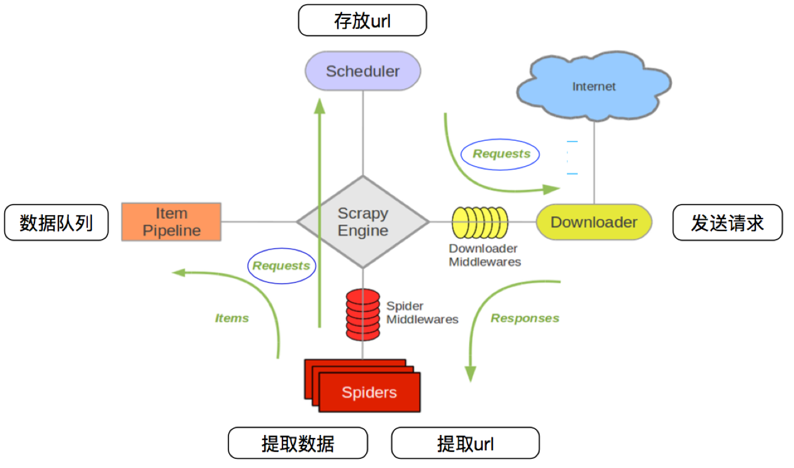

# Scrapy采集框架

**学习目标：**

1. 掌握 虚拟环境的搭建
2. 了解 scrapy的概念
3. 掌握 scrapy框架的运行流程
4. 应用 解析并获取scrapy爬虫中的数据
5. 应用 scrapy管道的基本使用
6. 了解 scrapy debug信息
7. 了解 scrapy shell的使用
8. 掌握 scrapy的settings.py设置
9. 掌握 scrapy管道(pipelines.py)的使用

   ​


## 一、scrapy的概念和流程

### 项目搭建前的准备

1. 搭建虚拟环境

   1. 目的:不让其他的环境资源干扰到当前项目

   2. 创建方式:(miniconda为例)

      1. **查看当前存在的虚拟环境**

         - conda env list

      2. **创建虚拟环境**

         - conda create -n 环境名 python=x.x

      3. **激活指定虚拟环境**

         - activate 环境名

      4. **删除退出虚拟环境**

         - deactivate   退出
         - conda remove -n 环境名 --all


   3. 包的导出和导入

      1. 导出
         - pip list
         - pip freeze > ./requirements.txt
      2. 导入
         - pip install -r ./requirements.txt


### 1、为什么学习scrapy？

1. scrapy不能解决剩下的10%的爬虫需求
2. 能够让开发过程方便、快速
3. scrapy框架能够让我们的爬虫效率更高

### 2、什么是scrapy？

文档地址：https://www.osgeo.cn/scrapy/intro/install.html

Scrapy 使用了Twisted['twɪstɪd]异步网络框架，可以加快我们的下载速度。

**Scrapy是一个为了爬取网站数据，提取结构性数据而编写的应用框架**，我们只需要实现少量的代码，就能够快速的抓取。

### 3、异步和非阻塞的区别

前面我们说Twisted是一个异步的网络框架，经常我们也听到一个词语叫做非阻塞，那么他们有什么区别呢？


**异步**：调用在发出之后，这个调用就直接返回，不管有无结果；异步是过程。 **非阻塞**：关注的是程序在等待调用结果（消息，返回值）时的状态，指在不能立刻得到结果之前，该调用不会阻塞当前线程。

### 4、scrapy的工作流程

#### 4.1 回顾之前的爬虫流程


#### 4.2 上面的流程可以改写为


#### 4.3 scrapy的流程



**其流程可以描述如下：**

1. 调度器把requests-->引擎-->下载中间件--->下载器
2. 下载器发送请求，获取响应---->下载中间件---->引擎--->爬虫中间件--->爬虫
3. 爬虫提取url地址，组装成request对象---->爬虫中间件--->引擎--->调度器
4. 爬虫提取数据--->引擎--->管道
5. 管道进行数据的处理和保存

**注意：**

- 图中绿色线条的表示数据的传递
- 注意图中中间件的位置，决定了其作用
- 注意其中引擎的位置，所有的模块之前相互独立，只和引擎进行交互

#### 4.4 scrapy中每个模块的具体作用


## 二、scrapy的入门使用

### 1 scrapy项目实现流程

1. 创建一个scrapy项目:scrapy startproject mySpider
2. 生成一个爬虫:scrapy genspider douban movie.douban.com
3. 提取数据:完善spider，使用xpath等方法
4. 保存数据:pipeline中保存数据

### 2 创建scrapy项目

> 下面以抓取豆瓣top250来学习scrapy的入门使用：https://movie.douban.com/top250

安装scrapy命令：sudo apt-get install scrapyscrapy==2.5.0 或者：pip install scrapy==2.5.0

**注意：**

- 安装2.5版本之后运行代码可能会遇到以下错误

```python
AttributeError: module 'OpenSSL.SSL' has no attribute 'SSLv3_METHOD'
```

```python
ImportError: cannot import name 'HTTPClientFactory' from 'twisted.web.client' (unknown location)
```

- 降低OpenSSL和cryptography以及Twisted的版本

```python
pip install pyOpenSSL==22.0.0
pip install cryptography==38.0.4
pip install Twisted==20.3.0
```

- 2.5的版本适配的是3.7的py版本,需要找到你解释器对应的版本信息
- 可以运行尝试


#### 1.创建项目面板

```python
scrapy 2.5.0 - no active project

usage:
  scrapy <command>[options] [args]

Available commands :
  bench      Run quick benchmark test #测试电脑性能
  fetch      Fetch a URL using the scrapy down1oader#将源代码下载下来并显示出来
  genspider      Generate new spider using pre-defined temp1ates#创建一个新的spider文件
  runspider      Run a self-contained spider (without creating a project)# 这个和通过craw1启动爬虫不同，scrapy runspider爬虫文件名称
  settings      Get settings values#获取当前的配置信息
  she11      Interactive scraping console#进入scrapy 的交互模式
  startproject      create new project#创建爬虫项目
  version      Print scrapy version#显示scrapy框架的版本
  view      open URL in browser，as seen by scrapy#将网页document内容下载下来，并且在浏览器显示出来
```

创建scrapy项目的命令：scrapy startproject +<项目名字>

示例：scrapy startproject myspider

生成的目录和文件结果如下：


### 3 创建爬虫

命令：**在项目路径下执行**:scrapy genspider +<爬虫名字> + <允许爬取的域名>

示例：

```
cd myspider
scrapy genspider douban movie.douban.com
```

生成的目录和文件结果如下：


### 4 完善spider

完善spider即通过方法进行数据的提取等操作

在\myspider\myspider\douban.py中修改内容如下:

```python
import scrapy

# 自定义spider类，继承scrapy.spider
class DoubanSpider(scrapy.Spider):
    # 爬虫名字
    name = 'douban'
    # 允许爬取的范围，防止爬虫爬到别的网站
    allowed_domains = ['douban.com']
    # 开始爬取的url地址
    start_urls = ['https://movie.douban.com/top250']

    # 数据提取的方法，接受下载中间件传过来的response
    def parse(self, response):
        # scrapy的response对象可以直接进行xpath
        ol_list = response.xpath('//ol[@class="grid_view"]/li')
        print(ol_list)
        for ol in ol_list:
            # 创建一个数据字典
            item = {}
            # 利用scrapy封装好的xpath选择器定位元素，并通过extract()或extract_first()来获取结果
            item['title'] = ol.xpath('.//div[@class="hd"]/a/span[1]/text()').extract_first()
            item['rating'] = ol.xpath('.//div[@class="bd"]/div/span[2]/text()').extract_first()
            item['quote'] = ol.xpath('.//div[@class="bd"]//p[@class="quote"]/span/text()').extract_first()
            print(item)
```

**注意：**

1. response.xpath方法的返回结果是一个类似list的类型，其中包含的是selector对象，操作和列表一样，但是有一些额外的方法
2. extract() 返回一个包含有字符串的列表
3. extract_first() 返回列表中的第一个字符串，列表为空没有返回None
4. spider中的parse方法必须有
5. 需要抓取的url地址必须属于allowed_domains,但是start_urls中的url地址没有这个限制
6. 启动爬虫的时候注意启动的位置，是在项目路径下启动

#### 4.1 response对象属性

1. url HTTP相应的 URL地址，str类型的

2. status HTTP响应状态码，int类型的（在pycharm的控制台中你可以看到，例如200,404）

3. body HTTP响应正文，bytes类型

4. text 文本形式的HTTP响应正文，str类型，由response.body使用response.encoding解码得到

5. encoding HTTP响应正文的编码

6. request 产生该HTTP响应的Requset对象

7. selector (这个比较重要了)选择器对象用来提取response中的数据

8. xpath(query) 即xml路径语言，用来确定xml文档中某部分位置的语言（html属性xml）

9. css(query) 也是一种选择器，用来提取页面内中的数据，但是不如xpath强大。

10. urljoin(url) 用来构造绝对url

   ​

### 5 利用管道pipeline来处理(保存)数据

#### 5.1 对douban爬虫进行修改完善

在爬虫文件douban.py中parse()函数中最后添加

```
yield item
```

**注意：yield能够传递的对象只能是：BaseItem,Request,dict,None**

#### 5.2 修改pipelines.py文件

```python
class MyspiderPipeline:
    # 爬虫文件中提取数据的方法每yield一次item，就会运行一次
    # 该方法为固定名称函数
    def process_item(self, item, spider):
        print(item)
```

#### 5.3 在settings.py设置开启pipeline

```
ITEM_PIPELINES = {
   'myspider.pipelines.MyspiderPipeline': 300,
}

# 协议证书配置
# Obey robots.txt rules
ROBOTSTXT_OBEY = False

# 带上请求头
# Override the default request headers:
DEFAULT_REQUEST_HEADERS = {
  'Accept': 'text/html,application/xhtml+xml,application/xml;q=0.9,*/*;q=0.8',
  'Accept-Language': 'en',
'User-Agent': 'Mozilla/5.0 (Windows NT 10.0; Win64; x64) AppleWebKit/537.36 (KHTML, like Gecko) Chrome/109.0.0.0 Safari/537.36'
}
```


### 6 运行scrapy

#### 6.1命令运行

命令：在项目目录下执行scrapy crawl +<爬虫名字>

示例：scrapy crawl douban --nolog

#### 6.2 debug运行

```python
# scrapy封装的命令执行
from scrapy import cmdline

if __name__ == '__main__':
    # 解析的是一个列表对象
    # 获取的json文件会乱码 需要修改配置 FEED_EXPORT_ENCODING = 'utf-8'
    cmdline.execute('scrapy crawl douban -o douban.json -s FEED_EXPORT_ENCODING="utf-8"'.split())
```


### 7.输出的数据日志信息

#### 7.1 日志等级

- CRITICAL：严重错误
- ERROR：一般错误
- WARNING：警告
- INFO: 一般信息
- DEBUG：调试信息

**注意：** 默认的日志等级是DEBUG

#### 7.2日志输出信息

```txt
Versions:使用的工具版本信息
Overridden settings： 重写的配置
Telnet Password：Telnet 平台密码（Scrapy附带一个内置的telnet控制台，用于检查和控制Scrapy运行过程）
Enabled extensions ：开启的拓展功能
Enabled downloader middlewares：开启的下载器中间件
Enabled spider middlewares：开启的爬虫中间件
Enabled item pipelines：开启的管道
Dumping Scrapy stats：所以的信息汇总
```

#### 7.3 日志等级设置

- 修改settings.py文件

```python
LOG_LEVEL = 'WARNING' # 设置日志显示的等级为WARNING
LOG_FILE = './log.txt' # 将日志信息全部记录到log.txt文件中
```


## 三、scrapy发送翻页请求

### 1. 翻页请求的思路

对于要提取如下图中所有页面上的数据该怎么办？


回顾requests模块是如何实现翻页请求的：

1. 找到下一页的URL地址
2. 调用requests.get(url)

scrapy实现翻页的思路：

1. 找到下一页的url地址
2. 构造url地址的请求，传递给引擎

### 2 scrapy实现翻页请求

#### 2.1 实现方法

1. 确定url地址
2. 构造请求，scrapy.Request(url,callback)
   - callback：指定解析函数名称，表示该请求返回的响应使用哪一个函数进行解析
3. 把请求交给引擎：yield scrapy.Request(url,callback)

#### 2.2 豆瓣爬虫

> 通过爬取豆瓣top250页面的电影信息,学习如何实现翻页请求
>
> 地址：https://movie.douban.com/top250

##### 思路分析：

1. 获取首页的数据
2. 寻找下一页的地址，进行翻页，获取数据

##### 注意：

1. 可以在settings中设置ROBOTS协议

   ```
   # False表示忽略网站的robots.txt协议，默认为True
   ROBOTSTXT_OBEY = False

   ```

2. 可以在settings中设置User-Agent：

   ```
   # scrapy发送的每一个请求的默认UA都是设置的这个User-Agent
   USER_AGENT = 'Mozilla/5.0 (Macintosh; Intel Mac OS X 10_12_5) AppleWebKit/537.36 (KHTML, like Gecko) Chrome/59.0.3071.115 Safari/537.36'

   ```

#### 2.3 代码实现

在爬虫文件的parse方法中：

```python
# 数据提取的方法，接受下载中间件传过来的response
    def parse(self, response):
        # print(response.urljoin('asfd'))
        # scrapy的response对象可以直接进行xpath
        ol_list = response.xpath('//ol[@class="grid_view"]/li')
        # 提取下一页的href并拼接url
        # print(ol_list)
        for ol in ol_list:
            # 创建一个数据字典
            # item = MyspiderItem()
            item = {}
            # 利用scrapy封装好的xpath选择器定位元素，并通过extract()或extract_first()来获取结果
            item['title'] = ol.xpath('.//div[@class="hd"]/a/span[1]/text()').extract_first()
            item['rating'] = ol.xpath('.//div[@class="bd"]/div/span[2]/text()').extract_first()
            item['quote'] = ol.xpath('.//div[@class="bd"]//p[@class="quote"]/span/text()').extract_first()
            print(item)
            # 构造scrapy.Request对象，并yield给引擎
            # 利用callback参数指定该Request对象之后获取的响应用哪个函数进行解析
            # 利用meta参数将本函数中提取的数据传递给callback指定的函数
            # 注意这里是yield
            yield item
        if response.xpath("//a[text()='后页>']/@href").extract_first() != None:
            next_url = response.urljoin(response.xpath("//a[text()='后页>']/@href").extract_first())
            print(next_url)
            yield scrapy.Request(url=next_url, callback=self.parse)
```


#### 2.4 scrapy.Request的更多参数

```
scrapy.Request(url[,callback,method="GET",headers,body,cookies,\
meta,dont_filter=False])
```

##### 参数解释

1. 中括号中的参数为可选参数

2. callback：表示当前的url的响应交给哪个函数去处理

3. meta：实现数据在不同的解析函数中传递，meta默认带有部分数据，比如下载延迟，请求深度等

4. dont_filter:默认为False，会过滤请求的url地址，即请求过的url地址不会继续被请求，对需要重复请求的url地址可以把它设置为Ture，比如贴吧的翻页请求，页面的数据总是在变化;start_urls中的地址会被反复请求，否则程序不会启动

5. method：指定POST或GET请求

6. headers：接收一个字典，其中不包括cookies

7. cookies：接收一个字典，专门放置cookies

8. body：接收一个字典，为POST的数据

   ​

#### 2.5 重写start_requests方法

上述方法可以帮助我们实现翻页的问题,但是这种翻页并不是框架的最优解,我们可以重写Spider的start_requests方法,自己生成对应的请求网址给到引擎进行调度

```python
    def start_requests(self):
        for i in range(0, 10):
            url = 'https://movie.douban.com/top250?start={}&filter='.format(i * 25)
            yield scrapy.Request(url)
```


### 3 meta参数的使用

##### meta的形式:字典

##### meta的作用：meta可以实现数据在不同的解析函数中的传递

在爬虫文件的parse方法中，提取详情页增加之前callback指定的parse_detail函数：

```
def parse(self,response):
    ...
    yield scrapy.Request(detail_url, callback=self.parse_detail,meta={"item":item})
...

def parse_detail(self,response):
    #获取之前传入的item
    item = resposne.meta["item"]

```

##### 特别注意

1. meta参数是一个字典
2. meta字典中有一个固定的键`proxy`，表示代理ip，关于代理ip的使用我们将在scrapy的下载中间件的学习中进行介绍
3. download_timeout设置请求超时


### 4. item的使用

#### 4.1 Item能够做什么

1. 定义item即提前规划好哪些字段需要抓取，scrapy.Field()仅仅是提前占坑，通过item.py能够让别人清楚自己的爬虫是在抓取什么，同时定义好哪些字段是需要抓取的，没有定义的字段不能使用，防止手误
2. 在python大多数框架中，大多数框架都会自定义自己的数据类型(在python自带的数据结构基础上进行封装)，目的是增加功能，增加自定义异常

#### 4.2 定义Item

在items.py文件中定义要提取的字段：

```
class MyspiderItem(scrapy.Item):
    title = scrapy.Field()  # 标题
    rating = scrapy.Field()  # 评估
    quote = scrapy.Field()  # 概述
```

#### 4.3 使用Item

Item使用之前需要先导入并且实例化，之后的使用方法和使用字典相同

修改爬虫文件douban.py：

```python
from myspider.items import MyspiderItem  # 导入Item，注意路径
...
    def parse(self, response):
        # print(response.meta['data'])
        ol_list = response.xpath('//ol[@class="grid_view"]/li')

        for ol in ol_list:
            item = MyspiderItem()
            item['title'] = ol.xpath('.//div[@class="hd"]/a/span[1]/text()').extract_first()
            item['rating'] = ol.xpath('.//div[@class="bd"]/div/span[2]/text()').extract_first()
            item['quote'] = ol.xpath('.//div[@class="bd"]//p[@class="quote"]/span/text()').extract_first()
            # item['yeshu'] = response.meta['data']
            # print(item)
            yield item
```

##### 注意：

1. from myspider.items import MyspiderItem这一行代码中 注意item的正确导入路径，忽略pycharm标记的错误
2. python中的导入路径要诀：从哪里开始运行，就从哪里开始导入


## 四、scrapy的管道使用

### 1. 了解scrapyShell

​	scrapy shell是scrapy提供的一个终端工具，能够通过它查看scrapy中对象的属性和方法，以及测试xpath

使用方法：

```
scrapy shell https://movie.douban.com/top250
```

在终端输入上述命令后，能够进入python的交互式终端，此时可以使用：

- response.xpath()：直接测试xpath规则是否正确
- response.url：当前响应的url地址
- response.request.url：当前响应对应的请求的url地址
- response.headers：响应头
- response.body：响应体，也就是html代码，默认是byte类型
- response.requests.headers：当前响应的请求头

### 3 settings.py中的设置信息

##### 3.1 为什么项目中需要配置文件

​	在配置文件中存放一些公共变量，在后续的项目中方便修改，如：本地测试数据库和部署服务器的数据库不一致

##### 3.2 配置文件中的变量使用方法

1. 变量名一般全部大写
2. 导入即可使用

##### 3.3 settings.py中的重点字段和含义

- USER_AGENT 设置ua
- ROBOTSTXT_OBEY 是否遵守robots协议，默认是遵守
- CONCURRENT_REQUESTS 设置并发请求的数量，默认是16个
- DOWNLOAD_DELAY 下载延迟，默认无延迟
- COOKIES_ENABLED 是否开启cookie，即每次请求带上前一次的cookie，默认是开启的
- DEFAULT_REQUEST_HEADERS 设置默认请求头，这里加入了USER_AGENT将不起作用
- SPIDER_MIDDLEWARES 爬虫中间件，设置过程和管道相同
- DOWNLOADER_MIDDLEWARES 下载中间件
- LOG_LEVEL 控制终端输出信息的log级别，终端默认显示的是debug级别的log信息
  - LOG_LEVEL = "WARNING"
- LOG_FILE 设置log日志文件的保存路径，如果设置该参数，终端将不再显示信息
  - LOG_FILE = "./test.log"
- 其他设置参考：[https://www.jianshu.com/p/df9c0d1e9087](https://www.jianshu.com/p/df9c0d1e9087)


### 4 pipeline管道的深入使用

> 之前我们在scrapy入门使用一节中学习了管道的基本使用，接下来我们深入的学习scrapy管道的使用

##### 4.1 pipeline中常用的方法：

1. process_item(self,item,spider):实现对item数据的处理
2. open_spider(self, spider): 在爬虫开启的时候仅执行一次
3. close_spider(self, spider): 在爬虫关闭的时候仅执行一次

#### 4.2 管道文件的修改

在pipelines.py代码中完善

```
import pymysql
import pymongo


class MyspiderMySQLPipeline:
    def open_spider(self, spider):
        # 判断是哪个爬虫  名字不同可能执行的爬虫项目也不同
        if spider.name == 'douban':
            self.db = pymysql.connect(host="localhost", user="root", password="root", db="spiders9")
            self.cursor = self.db.cursor()
            # 创建变语法
            sql = '''
                                CREATE TABLE IF NOT EXISTS douban(
                                    id int primary key auto_increment not null,
                                    quote VARCHAR(255) NOT NULL, 
                                    rating VARCHAR(255) NOT NULL, 
                                    title VARCHAR(255) NOT NULL)
                                '''
            try:
                self.cursor.execute(sql)
                print("CREATE TABLE SUCCESS.")
            except Exception as ex:
                print(f"CREATE TABLE FAILED,CASE:{ex}")

    def process_item(self, item, spider):
        # SQL 插入语句
        sql = 'INSERT INTO douban(id, quote, rating, title) values(%s, %s, %s, %s)'
        # 执行 SQL 语句
        try:
            self.cursor.execute(sql, (0, item['quote'], item['rating'], item['title']))
            # 提交到数据库执行
            self.db.commit()
            print('mysql数据插入成功...')
        except Exception as e:
            print(f'数据插入失败: {e}')
            # 如果发生错误就回滚
            self.db.rollback()
        # 不return的情况下，另一个权重较低的pipeline将不会获得item,否则后一个pipeline取到的数据为None值
        return item 

    def close_spider(self, spider):  # 在爬虫关闭的时候仅执行一次
        # 关闭文件
        if spider.name == 'douban':
            self.db.close()


class MyspiderMongoDBPipeline:
    def open_spider(self, spider):  # 在爬虫开启的时候仅执行一次
        if spider.name == 'douban':
            con = pymongo.MongoClient(host='127.0.0.1', port=27017)  # 实例化mongoclient
            self.collection = con.spiders9.douban  # 创建数据库名为spiders9,集合名为douban的集合操作对象

    def process_item(self, item, spider):
        if spider.name == 'douban':
            print('mongo保存成功')
            self.collection.insert_one(dict(item))  # 此时item对象需要先转换为字典,再插入
        # 不return的情况下，另一个权重较低的pipeline将不会获得item
        return item
```

#### 4.3 开启管道

在settings.py设置开启pipeline

```
ITEM_PIPELINES = {
   'myspider.pipelines.MyspiderMySQLPipeline': 300,
   'myspider.pipelines.MyspiderMongoDBPipeline': 400,
}
```

**思考：pipeline在settings中能够开启多个，为什么需要开启多个？**

1. 不同的pipeline可以处理不同爬虫的数据，通过spider.name属性来区分
2. 不同的pipeline能够对一个或多个爬虫进行不同的数据处理的操作，比如一个进行数据清洗，一个进行数据的保存
3. 同一个管道类也可以处理不同爬虫的数据，通过spider.name属性来区分

#### 4.4 pipeline使用注意点

1. 使用之前需要在settings中开启
2. pipeline在setting中键表示位置(即pipeline在项目中的位置可以自定义)，值表示距离引擎的远近，越近数据会越先经过
3. 有多个pipeline的时候，process_item的方法必须return item,否则后一个pipeline取到的数据为None值
4. pipeline中process_item的方法必须有，否则item没有办法接受和处理
5. process_item方法接受item和spider，其中spider表示当前传递item过来的spider
6. open_spider(spider) :能够在爬虫开启的时候执行一次
7. close_spider(spider) :能够在爬虫关闭的时候执行一次
8. 上述俩个方法经常用于爬虫和数据库的交互，在爬虫开启的时候建立和数据库的连接，在爬虫关闭的时候断开和数据库的连接